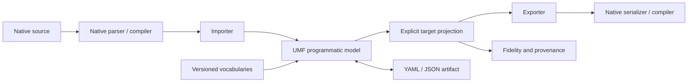

---
ddx:
  id: umf.architecture
  type: architecture
  activity: design
  status: draft
  authoring:
    home: repo
  links:
    - id: umf.prd
      kind: informed_by
    - id: umf.cross-cutting-requirements
      kind: informed_by
---

# UMF Architecture

## Scope

UMF is a lossless, extensible semantic interchange representation with a small
common core and independently versioned vocabularies. This design follows the
owner's bootstrap brief and [PRD](../01-frame/prd.md), constrained by
[NFR-1–NFR-50](../01-frame/cross-cutting-requirements.md).

The initial design target is the JSON Schema + Protobuf slice in FR-37.
JSON Schema is the JSON Schema project's schema vocabulary and validation
standard for JSON data. Protobuf is Google's Protocol Buffers serialization
and schema system. Native semantic models remain authoritative for native
meaning; neither system defines the worldview of UMF core.

This is a logical design, not an implemented deployment. The owner's subsequent
2026-09-20 direction requires browser execution through JavaScript or WebAssembly
(WASM), with TypeScript as the preferred implementation language. Use TypeScript
compiled to JavaScript as the default and Bun for development/testing under
[ADR-002](adr/ADR-002-bun-development-runtime.md). Library versions, browser versions, exact
document and adapter contracts, and native support subsets remain spike decisions.

## Level 1: System Context

| Participant | Relationship to UMF | Boundary |
| --- | --- | --- |
| Schema authors and tooling | Create, inspect, validate, compare, and transform artifacts | Programmatic and human workflows; no mandatory UI |
| Native ecosystem tools | Parse, serialize, and evaluate native schemas | Reuse established native implementations where possible |
| Extension authors | Publish versioned vocabularies, rules, capabilities, and fixtures | Installation/trust decisions are independent of artifact contents |
| TableSpec | Intended producer/consumer of table and data definitions | Existing schemas must be inspected for compatibility |
| Axon | Intended consumer of domain, graph, authority, and physical bindings | Query/mutation execution belongs to Axon |
| Palantir Ontology | Later native operational-model interchange | Preserve declared exposed semantics; no generic-core promotion by assumption |

TableSpec and Axon roles are supplied by the owner; their source repositories
have not been inspected. Palantir coverage depends on the selected public or
authorized native interface and version, not a claim about inaccessible internals.

The owner's intended Axon flow is: structural, graph, authority, relational-binding,
and Axon-native semantics feed a typed operational graph and logical query/mutation
model; heterogeneous physical execution remains in Axon. TableSpec produces and
consumes table/data artifacts as a peer rather than owning UMF's definition.

The brief names object types, properties, links, interfaces, value types, actions,
datasource mappings, and policy/capability metadata as Palantir preservation
candidates. This is an inventory to validate against the chosen native interface,
not a researched completeness claim or a list of mandatory core primitives.

## Level 2: Container Diagram

The initial executable is a browser-compatible library and a command-line
entry point sharing the same programmatic model. No persistent service,
database, cloud runtime, or network registry is required by the brief.

| Unit | Technology Direction | Responsibility | Boundary |
| --- | --- | --- | --- |
| UMF library/tooling | TypeScript compiled to JavaScript; JSON-compatible values; YAML authoring | Model access, operations, diagnostics | Browser-compatible dependencies and packaged vocabularies; host I/O stays outside the library |
| Vocabulary packages | JSON Schema structural definitions plus semantic specifications | Versions, validation, capabilities, fixtures | Package metadata is data; it does not authorize code execution |
| Native adapters | Selected ecosystem parsers/compiler APIs | Import/export through native semantic representations | Native output must pass native validation |
| Conformance harness | Bun test runner; separate browser execution and pinned native oracles | Round-trip and projection evidence | Evidence generation is separate from support declarations |

## Level 3: Component Diagram

| Component | Responsibility | Failure Boundary |
| --- | --- | --- |
| Document reader/writer | Preserve JSON-compatible data and uninterpreted extension content | Reject unsupported serialization constructs explicitly; never coerce silently |
| Programmatic model | Stable identities, references, core concepts, native vocabularies, and origins | Typed access must not discard fields outside the consumer's knowledge |
| Extension registry | Resolve declared identifiers/versions and capability descriptions | Missing versions, collisions, and conflicts are explicit |
| Validation coordinator | Distinct syntax, structure, reference, core, extension, and target checks | A successful structural check cannot certify semantic validity |
| Reference resolver | Explicit, deterministic packaged dependencies | Ambiguity fails; missing input never triggers arbitrary network traversal |
| Projection engine | Apply declared mappings against target capabilities | Approximation and non-expressibility remain visible |
| Diagnostics/provenance | Identify source and target concepts, rules, operations, and outcomes | Reports distinguish preservation in UMF from target behavior |
| Adapter pair | Import/export native meaning through the model | Native semantics remain source-specific where no safe common mapping exists |

### Core and vocabulary boundaries

The owner's 2026-09-21 direction prioritizes TableSpec, PostgreSQL, SQL Server, Avro
and Parquet ingestion. The next core expansion must expose shared field types and
metadata rather than require every consumer to decode native payloads. A scalar
type field is a required design/implementation deliverable. Its basic value families
must be distinguished from native refinements: widths/ranges, decimal precision and
scale, collation/encoding, date calendars and timestamp timezone/unit behavior.
Preserve native representations alongside shared metadata and report any projection
that cannot preserve those refinements. Native parsing and physical execution rules
do not become identical merely because two columns share a scalar family.

Core has two distinct gates. **Ideal admission** defines UMF meaning: a written
meaning, counterexamples, down-projections to at least two of the five priority
systems, and up-classification retaining unknown/native refinements. Native
agreement is not a prerequisite for UMF to define an ideal. **Equivalence
graduation** claims that core can replace a native concept; only this claim
requires multiple independent adapters mapping both ways without material semantic
change, migration, rollback and zero preservation regressions.

The ordered core backlog is field, nullability, cardinality, author-stated facets,
and key, governed by CONTRACT-040 and TD-040–TD-044. Author the semantic contract
before changing the envelope schema. scalarType is already the first ideal:
family classification is not equivalence. Admission at two systems does not
complete delivery: each concept needs TableSpec, PostgreSQL, SQL Server, Avro and
Parquet bindings, including explicit refusals/residuals where necessary. OWL,
DDD lifecycle, physical encodings and default-as-execution remain extensions.

Consumers read the ideal and adapters retain native representations (FR-20).
Ideal → native → ideal recovers the authored ideal or an explicit residual;
native → ideal → native recovers all native text/bytes outside the ideal's claim.
Strict mode blocks loss; report mode emits it. No core label deletes native data.

Generic vocabulary candidates are structural, relational, graph, authority,
provenance, quality, API, and actions. Their example `umf.*` names from the brief
are provisional identifiers. External vocabulary candidates are retained in
the expansion table below. No universal type lattice, inference engine, or
single graph/relational interpretation is assumed.

Every extension package describes identity/namespace, version, structural
schema, semantic rules, validator capability, understood/emittable constructs,
applicable import/export directions, and real round-trip fixtures. Semantic
validator implementations are separately installed trusted tooling; the model
does not execute instructions carried by untrusted artifacts.

### Domain-driven design vocabulary

Domain-driven design (DDD) enters as the early `umf.ddd` extension under FR-40,
after the initial JSON Schema + Protobuf demonstration. The flow is
`DDD model → core + umf.ddd → explicit target projections`. Source examples
and intent are retained in [discovery input](../00-discover/vision-input.md).

| Concept | Representation boundary |
| --- | --- |
| Entity, value object/type, identity, references/relationships, invariants/constraints, namespace/module | UMF ideals may classify these under FR-3 without replacing DDD meaning; native replacement requires FR-28 equivalence. Keep DDD-specific equality and lifecycle in the extension |
| Bounded context | DDD meaning attached to a module/namespace carrier; a namespace alone does not establish a bounded context |
| Aggregate root and boundary | Explicit root, membership, and invariant scope; independent of table, document, or graph layout |
| Domain service, repository, domain event | Domain declarations and relationships; no generated execution, persistence, messaging, or endpoint behavior implied |
| Context map and anti-corruption layer | Explicit context-qualified source/target references, mapping direction and limitations, and translation boundary intent |
| Ubiquitous-language terms | Context-scoped terms and definitions; aliases do not imply cross-context identity |

Keep `sales.Customer`, `support.Customer`, and `billing.AccountHolder` distinct,
even with identical properties. Context mappings can be partial and one-way;
reverse mappings require separate evidence. Do not equate DDD entities with
graph nodes, aggregates with tables, or repositories with API endpoints.

DDD describes meaning; core and extensions carry it; bindings describe its
physical representation; Axon/TableSpec and other consumers execute it. Axon
consumes the independent DDD vocabulary and cannot become its semantic authority.

| Order aggregate projection | Possible target shape | Fidelity obligation |
| --- | --- | --- |
| SQL | `orders` and `order_lines` tables | Retain aggregate membership and invariants separately; foreign keys do not establish aggregate enforcement |
| Document schema | Embedded order and lines | Embedding does not itself establish transaction/lifecycle semantics |
| Axon | Entities and relationships forming a subgraph | Preserve DDD intent independently of Axon's execution rules; exact Axon interface unresolved |
| OpenAPI | Explicit command operations and data transfer objects (DTOs) | DTO structure does not express aggregate consistency; operations require mapping decisions |
| Palantir | Aggregate root as Object Type; selected operations as Actions | Candidate mapping only; native action behavior, authority, and enforcement require separate evidence |

An initial synthetic sales corpus must include Order, OrderLine,
ShippingAddress, Money, an OrderPlaced event, and separate sales/support Customer
definitions with a partial context mapping. Define identity, equality, root and
membership rules, invariant scope, event meaning, terminology, and mapping
direction in the DDD contract before coding. Invariants may be declarative or
opaque expressions: preserve their language/version and interpretation status;
structural validation is not execution or proof of the domain rule.

No single native DDD serialization has been selected. Define a versioned
UMF-authored DDD profile with a reviewed semantic fixture oracle, and name
external DDD tool formats separately when added. A profile round trip cannot
claim compatibility with all DDD tools. An unedited stored source blob alone
does not satisfy typed access, edit propagation, or semantic validation.

Equivalence graduation (not ideal admission) requires documented semantic preconditions, counterexamples,
two independent extension mappings in both directions, migration and rollback
fixtures for earlier artifacts, and zero native/unknown-content regressions.
Identity of a schema element is not automatically DDD entity identity; JSON
Schema value constraints do not automatically express aggregate invariants.

### Serialization and validation

YAML-first authoring loads a JSON-compatible document, undergoes JSON Schema
structural validation, and then version-aware semantic validation over the
programmatic representation. See [ADR-001](adr/ADR-001-bootstrap-representation.md).
The diagram describes validation stages, not a mandate to delay all model
construction until semantic validation finishes.

Foreign-key compatibility, identity and reference validity, cross-definition
invariants, and native field-number or ontology constraints belong to semantic
validators. Structural schemas must not impersonate full native validation.
Duplicate keys, non-JSON YAML values/tags, aliases/cycles, numeric precision,
reference base resolution, and preservation rules need explicit contracts
before the first implementation. Do not silently accept parser-specific behavior.

### Programmatic metamodel and metadata consumers

FR-41 requires programmatic traversal, selection, composition and safe editing
across core and understood vocabularies. Core plus extensions carries the
representational superset of native storage and compute shapes, including
competing meanings and content a consumer cannot yet interpret. Adding a new
system does not authorize collapsing existing distinctions or discarding unknowns.

Consumer projections extract the metadata needed for transforms, visualization,
pipeline and validator generation, forms, AI-agent context, and human documentation.
Preserve context-qualified identities, reference dependencies, relevant constraints,
origins and interpretation status. Declare whether a projection includes referenced
definitions or retains external references; a dangling or omitted dependency must
be explicit. Metadata selection is not an implicit destructive rewrite of the source.

Use the same model API for these consumers rather than requiring native-format
parsing or human-document scraping. Keep declared and inferred metadata distinct.
Generated artifacts carry mapping/coverage limits; an unknown invariant cannot
become an asserted form rule, validator guarantee, or agent fact. Consumer code
executes pipelines, renders views, and hosts applications; UMF represents and
provides the metadata and transformations they use (NFR-50).

### Import, projection, and export

Conceptually, `decodeS` imports and `encodeS` exports. The native guarantee is
`encodeS(decodeS(x)) ≡S x`, with native-system/version equivalence and declared
subset boundaries. A common in-memory model is an API abstraction, not a
single canonical semantic interpretation and not a requirement to load an
entire schema catalog into memory.

Prefer native parsers and serializers: descriptor APIs for Protobuf, native
schema/abstract syntax tree libraries for API languages, established ontology
libraries, and database catalog inspection for future relational integrations.
Exact libraries and their versions remain unselected.

Projection produces a target view from source vocabularies plus common concepts.
It must retain the source representation and report exact preservation,
equivalent mapping, approximation, preserved-but-inexpressible content,
incompatibility, and unsupported semantics. Conceptual categories are governed
by FR-9; exact fields and codes belong in a future fidelity contract.

An incomplete projection is not a successful lossless conversion. Strictness
controls whether output may be produced; it never suppresses diagnostic truth.
The output's native validator checks target validity independently of fidelity.

Retaining the UMF source enables returning home; the standalone target may
not. The export packaging/association contract must make clear whether a future
consumer needs the retained UMF artifact. Do not promise source recovery from
target-only reimport when the target cannot carry that meaning.

## Deployment

Core, validation, and in-scope adapter transformations must execute in a browser
from supplied artifacts and packaged references, without requiring a server or
Bun-specific globals or Node.js filesystem/process APIs. Keep CLI file access and native compiler
invocation in host-specific tooling. Prefer browser-compatible parser libraries;
WASM is available when an adapter needs it, not a required core build target.
Independent native oracles may run on development/test workers; that does not
establish browser support for the adapter itself.

Execution also targets developer machines and automated test workers
with locally installed native tools and packaged references. No production
service is specified. Each run receives explicit artifacts, versions,
configuration, and resource limits. Artifacts and fixture evidence live in
source control or declared result storage; backup operations belong to the
hosting environment. Concurrency must not change semantics. Supported operating
systems, browser/runtime versions, and numeric resource budgets remain open.
Prioritize fidelity, simplicity, and browser usability over high throughput;
resource limits and transparent expensive operations remain required.

## Data Flow

1. Resolve a declared native dialect/version and parser configuration.
2. Parse source to its native semantic model; retain origins and required dependencies.
3. Import to the UMF model, preserving native-only and unknown extension content.
4. Run structural, reference, and applicable semantic checks separately.
5. For native return, export through the native model/serializer and compare
   using the native oracle. For cross-system output, project onto target capabilities first.
6. Emit native output plus fidelity/provenance evidence, identifying preservation
   outside the target and any unsafe or incomplete operation.

## Quality Attributes

| Attribute | Target | Strategy | Verification |
| --- | --- | --- | --- |
| Native fidelity | 100% pass within declared tested support; zero concealed exclusions | Native oracles and feature manifests | TP-001 native suites |
| Translation accountability | Zero unreported known mismatches in corpus | Concept-level fidelity and provenance | TP-001 projection tests |
| Unknown preservation | Zero unauthorized content loss | Model access preserves uninterpreted values | Parse-edit-write regressions |
| Reproducibility | Equivalent semantic results for identical declared inputs | Version/configuration pinning and explicit dependencies | Fresh-environment and offline reruns |
| Resource safety | Bounded by explicit run limits; numbers still open | Controlled resolution, depth/expansion limits | Adversarial fixtures; limit outcomes cannot report complete success |
| Minimal participation | Selected vocabularies operate without loading all others | Registry and operation-local understanding | Minimal-implementation conformance cases |

## Decisions and Tradeoffs

| Decision | Status | Rationale | Follow-up |
| --- | --- | --- | --- |
| Browser execution; TypeScript compiled to JavaScript by default | Browser target required by owner on 2026-09-20; TypeScript preferred | Simple implementation; high performance is not a primary driver | Pin browser/tool versions; verify browser round trips; consider WASM per adapter |
| Bun development and testing runtime | Accepted in ADR-002 | Explicit owner direction | Pin Bun and dependencies; retain independent browser/type-check gates |
| Small core plus versioned semantic vocabularies | Owner-directed; detailed model unproven | Preserve multiple native semantic systems | SPIKE-001 determines first common concepts |
| YAML-first, JSON-compatible bootstrap | Accepted direction in ADR-001 | Preserve human interchange and existing approach | Specify serialization edge cases |
| Native-semantic round-trip oracles | Owner-directed | Text equality is insufficient | TP-001 defines bounded oracle claims |
| Native libraries before new parsers | Preferred direction | Reuse ecosystem interpretation | Select versions and verify browser compatibility; keep independent native oracles in the harness |
| TypeSpec as interchange, not defining metamodel | Owner-directed | Avoid privileging its model absent fidelity evidence | Reconsider only with metamodel-wide evidence |
| LinkML as interchange and benchmark | Owner-directed | Learn from existing generators and compliance evidence | Measure actual semantic gaps; do not assert superiority |
| Runtime execution outside UMF | Required by NFR-50 | Preserve interchange boundary | Axon/TableSpec execution remains downstream |
| Self-description | Later capability, FR-35 | Test the model with its own vocabulary | Compare to bootstrap authority before any authority transition |

### Proposed ecosystem expansion

The sequence is from the owner; it is not a release schedule. Each phase must
declare versions, supported subsets, fixtures, and native equivalence before
claiming support. The first spike uses JSON Schema and Protobuf, not all Phase 1 formats.

| Phase | Candidates | New pressure on the model |
| --- | --- | --- |
| 1: Structural | JSON Schema, Avro, Protobuf | Primitives, records, enums, unions, presence, defaults, annotations, evolution |
| Early semantic slice, after JSON Schema + Protobuf | DDD (`umf.ddd`) | Context-specific identity/equality, aggregates, invariants, events, context maps; no storage dependency |
| 2: Graph/API | GraphQL schema definition language, OpenAPI, TypeSpec, Smithy | References, interfaces, operations, services, traits/decorators |
| 3: Physical data | PostgreSQL catalog/SQL, Spark StructType, Arrow, Delta, Iceberg, dbt | Keys, relationships, physical types/storage, indexes, table metadata |
| 4: Semantic | LinkML, Resource Description Framework (RDF), Web Ontology Language (OWL), Shapes Constraint Language (SHACL) | Class and graph models, logical semantics, constraints |
| 5: Operational | Palantir Ontology, Axon | Identity, authority, interfaces, bindings, query/action descriptions, policies |

Parquet, Open Data Contract Standard (ODCS), and CUE remain additional candidates
from the brief without an assigned phase. These names describe scope candidates;
their feature claims require separate native research.

### Proposed repository responsibilities

At the UMF repository root, future `spec/core/` and `spec/extensions/` hold
normative schemas and vocabulary packages; `src/model/`, `src/validation/`,
`src/registry/`, `src/transform/`, and `src/diagnostics/` implement responsibilities;
`adapters/` contains native boundaries; `fixtures/<system>/{basic,edge-cases,upstream}/`
and `tests/{roundtrip,cross_format,conformance,regression}/` organize evidence.
Governed docs remain under `docs/helix/`; the brief's illustrative `helix/` wrapper
does not require a nested repository. These directories are proposed, not created.

### Remaining design gates

Before build: inspect TableSpec's existing UMF schemas, pin browser/toolchain and
native versions, define exact core/extension/adapter/fidelity contracts, derive
feature/story acceptance criteria, and execute the bounded spike. Performance
budgets, native semantic equivalence, and unknown-content edit dependencies are
unresolved. This draft is sufficient to organize investigation, not to claim
implementation readiness or completed compatibility.

## Shared Exact JSON Helper (2026-09-20)

JSON Schema, Avro and OpenAPI now share `src/model/native-json.ts` and the identical
node definitions published as `spec/core/native-json.schema.json`. The old JSON
Schema helper import remains a compatibility export. A regression verifies encoding
identity and exact numeric preservation. OpenAPI adds JSON-compatible YAML parsing
into that same representation. This promotion is limited to JSON data representation;
it does not merge API, storage, domain, defaulting or coercion semantics.

TypeSpec now offers a separate pinned JSON Schema native emission API alongside no-emit
compilation and semantic inspection. It captures output files in memory, retains source,
requires explicit integer representation and reports incomplete semantic coverage.
CONTRACT-013 distinguishes native emitter evidence from a future loss-audited projection.

Smithy uses the shared NativeJson tree for its native JSON AST, with a separate
structural schema and incomplete semantic reports (CONTRACT-014). JVM assembly is a
development oracle, not a browser dependency. Candidate edits explicitly defer native
reference/trait validation; no source-retention evidence justifies new core semantics.

Smithy now separates archive/AST inspection from explicit native assembly. The public
TypeScript operation accepts a trusted installed backend; the pinned JavaScript port
is built and loaded separately. Assembly returns source, exact native model JSON, a
UMF AST model and native diagnostics with locations. Failures expose no partial model.
Runtime limitations and mixin normalization remain explicit; asynchronous typing alone
does not provide worker isolation or cancellation (CONTRACT-014, SPIKE-002).
