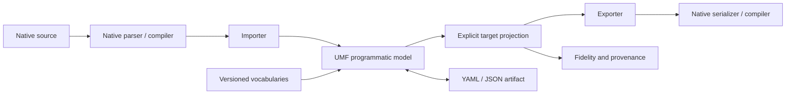

---
ddx:
  id: umf.architecture
  type: architecture
  activity: design
  status: draft
  authoring:
    home: repo
  links:
    - id: umf.prd
      kind: informed_by
    - id: umf.cross-cutting-requirements
      kind: informed_by
    - id: FEAT-006
      kind: informed_by
---

# UMF Architecture

## Scope

UMF is a lossless, extensible semantic interchange representation with a small
common core and independently versioned vocabularies. This design follows the
owner's bootstrap brief and [PRD](../01-frame/prd.md), constrained by
[NFR-1–NFR-50](../01-frame/cross-cutting-requirements.md).

The initial design and spike targeted the JSON Schema + Protobuf slice in FR-37.
JSON Schema is the JSON Schema project's schema vocabulary and validation
standard for JSON data. Protobuf is Google's Protocol Buffers serialization
and schema system. Native semantic models remain authoritative for native
meaning; neither system defines the worldview of UMF core.

The repository now implements a browser-compatible TypeScript library, compiled
to JavaScript, with Bun development/testing under
[ADR-002](adr/ADR-002-bun-development-runtime.md). Native compiler and database
oracles remain host-side evidence tools; optional native parsers use separately
built browser WASM. No production service or downstream execution engine is
specified. The initial spike is historical context, not the current library's
entire implemented scope.

This inventory describes the implementation merged through `0f20d2e4` and cites scoped feature evidence.
The [integrated acceptance](../../../fixtures/validation/relationship-integrated-acceptance-evidence.json) records the fresh native/browser replay, repository regression and six separate concept gates. Relationship ideal admission and qualified five-system delivery pass independently; native equivalence remains unclaimed.
Package presence, structural validation, target generation and native equivalence
remain different claims.

## Level 1: System Context

| Participant | Relationship to UMF | Boundary |
| --- | --- | --- |
| Schema authors and tooling | Create, inspect, validate, compare, and transform artifacts | Programmatic and human workflows; no mandatory UI |
| Native ecosystem tools | Parse, serialize, and evaluate native schemas | Reuse established native implementations where possible |
| Extension authors | Publish versioned vocabularies, rules, capabilities, and fixtures | Installation/trust decisions are independent of artifact contents |
| TableSpec | Intended producer/consumer of table and data definitions | Existing schemas must be inspected for compatibility |
| Axon | Intended consumer of domain, graph, authority, and physical bindings | Query/mutation execution belongs to Axon |
| Palantir Ontology | Later native operational-model interchange | Preserve declared exposed semantics; no generic-core promotion by assumption |

TableSpec and Axon roles are supplied by the owner. TableSpec now has pinned
native model/schema evidence within its qualified adapter subset; full consumer
integration and Axon runtime compatibility remain separate. Palantir coverage
depends on the selected public or
authorized native interface and version, not a claim about inaccessible internals.

The owner's intended Axon flow is: structural, graph, authority, relational-binding,
and Axon-native semantics feed a typed operational graph and logical query/mutation
model; heterogeneous physical execution remains in Axon. TableSpec produces and
consumes table/data artifacts as a peer rather than owning UMF's definition.

The brief names object types, properties, links, interfaces, value types, actions,
datasource mappings, and policy/capability metadata as Palantir preservation
candidates. This is an inventory to validate against the chosen native interface,
not a researched completeness claim or a list of mandatory core primitives.

## Level 2: Container Diagram

The implementation provides a browser-compatible library and host-side tooling
sharing the same programmatic model. No persistent service,
database, cloud runtime, or network registry is required by the brief.

| Unit | Technology Direction | Responsibility | Boundary |
| --- | --- | --- | --- |
| UMF library/tooling | TypeScript compiled to JavaScript; JSON-compatible values; YAML authoring | Model access, operations, diagnostics | Browser-compatible dependencies and packaged vocabularies; host I/O stays outside the library |
| Vocabulary packages | JSON Schema structural definitions plus semantic specifications | Versions, validation, capabilities, fixtures | Package metadata is data; it does not authorize code execution |
| Native adapters | Selected ecosystem parsers/compiler APIs | Import/export through native semantic representations | Native output must pass native validation |
| Conformance harness | Bun test runner; separate browser execution and pinned native oracles | Round-trip and projection evidence | Evidence generation is separate from support declarations |

```mermaid
flowchart LR
    S[Native source] --> P[Native parser / compiler]
    P --> I[Importer]
    I --> M[UMF programmatic model]
    V[Versioned vocabularies] --> M
    M --> X[Explicit target projection]
    X --> E[Exporter]
    E --> T[Native serializer / compiler]
    X --> D[Fidelity and provenance]
    M <--> Y[YAML / JSON artifact]
```

## Level 3: Component Diagram

| Component | Responsibility | Failure Boundary |
| --- | --- | --- |
| Document reader/writer | Preserve JSON-compatible data and uninterpreted extension content | Reject unsupported serialization constructs explicitly; never coerce silently |
| Programmatic model | Stable identities, references, core concepts, native vocabularies, and origins | Typed access must not discard fields outside the consumer's knowledge |
| Extension registry | Resolve declared identifiers/versions and capability descriptions | Missing versions, collisions, and conflicts are explicit |
| Validation coordinator | Distinct syntax, structure, reference, core, extension, and target checks | A successful structural check cannot certify semantic validity |
| Reference resolver | Explicit, deterministic packaged dependencies | Ambiguity fails; missing input never triggers arbitrary network traversal |
| Projection engine | Apply declared mappings against target capabilities | Approximation and non-expressibility remain visible |
| Diagnostics/provenance | Identify source and target concepts, rules, operations, and outcomes | Reports distinguish preservation in UMF from target behavior |
| Adapter pair | Import/export native meaning through the model | Native semantics remain source-specific where no safe common mapping exists |

### Core and vocabulary boundaries

The owner's 2026-09-21 priority remains TableSpec, PostgreSQL, SQL Server, Avro
and Parquet ingestion. Shared scalar families and authored ideals are implemented
without replacing native widths/ranges, decimal precision/scale, collation,
encoding or temporal behavior. The versioned envelope inventory is:

| Core version | Implemented authored surface | Boundary |
| --- | --- | --- |
| 0.1.0 | Original modules/elements/references, scalar-family metadata and native extension archives | Remains readable; references alone do not author relationships |
| 0.2.0 | Field/scalar authoring and explicit Record roles | Value families are classifications, not native domain equivalence |
| 0.3.0 | Nullability | Ideal availability differs from native missing/NULL/default/read contexts |
| 0.4.0 | Cardinality with item/value Field references | `one`/`array`/`map` shape is separate from relationship participation |
| 0.5.0 | Author-stated facets | Constraints retain explicit domains and unsupported/native-only refinements |
| 0.6.0 | Named stable Key identities and ordered Field components | Native indexes, comparison and NULL semantics remain qualified |
| 0.7.0 | Stable authored relationships between independently keyed Records | Target Key, participation, lifecycle, inverse and association Record intent do not imply physical enforcement |

The schemas in [spec/core](../../../spec/core/) and operations preserve older
versions through explicit migration/rollback receipts rather than silently
reinterpreting earlier documents. These envelopes remain experimental. Field
through Key have dated admission/five-system evidence, including the
[Key admission record](../04-build/evidence/key-gate-admission.md).
Relationship [core acceptance](../../../fixtures/validation/relationship-core-acceptance-evidence.json)
and individual bindings are delivered. The separate [relationship gate](../../../fixtures/validation/relationship-conformance.json) admits the authored ideal and qualified five-priority delivery with explicit residuals and refusals.

Core has two distinct gates. **Ideal admission** defines UMF meaning: a written
meaning, counterexamples, down-projections to at least two of the five priority
systems, and up-classification retaining unknown/native refinements. Native
agreement is not a prerequisite for UMF to define an ideal. **Equivalence
graduation** claims that core can replace a native concept; only this claim
requires multiple independent adapters mapping both ways without material semantic
change, migration, rollback and zero preservation regressions.

The Field → Nullability → Cardinality → Facets → Key sequence under CONTRACT-040
and TD-040–TD-044 has implemented schemas and APIs. CONTRACT-041 adds authored
relationships. Admission at two priority systems still does not complete delivery:
each ideal needs TableSpec, PostgreSQL, SQL Server, Avro and Parquet dispositions,
including explicit refusals/residuals. OWL, DDD lifecycle, physical encodings and
default-as-execution remain extension/native meanings.

Consumers read the ideal and adapters retain native representations (FR-20).
Ideal → native → ideal recovers the authored ideal or an explicit residual;
native → ideal → native recovers all native text/bytes outside the ideal's claim.
Strict mode blocks loss; report mode emits it. No core label deletes native data.

The current extension inventory is independently versioned. The following are
published packages, not a declaration that every native construct is supported:

| Package group | Package versions and scope |
| --- | --- |
| Domain and physical binding | `umf.ddd` 0.1.0; `umf.binding` 0.1.0 and stable-ID 0.2.0 |
| Priority native archives | `umf.tablespec`, `umf.postgresql`, `umf.postgresql.catalog`, `umf.sqlserver`, `umf.avro`, `umf.parquet`, each 0.1.0 |
| Priority ideal bindings | For each of `tablespec`, `postgresql`, `sqlserver`, `avro`, `parquet`: `umf.<system>.nullability`, `.cardinality`, `.facets`, `.keys`, `.relationships`, each 1.0.0; Field operations use their qualified native packages |
| Structural/API | `umf.json-schema`, `umf.protobuf`, `umf.graphql`, `umf.openapi`, `umf.typespec`, `umf.smithy`, each 0.1.0 |
| Storage/compute | `umf.arrow`, `umf.arrow.flatbuffer`, `umf.arrow.ipc`, `umf.spark`, `umf.delta`, `umf.delta.table`, `umf.delta.log`, `umf.iceberg`, `umf.iceberg.table`, each 0.1.0 |
| Data/semantic exchange | `umf.dbt.manifest`, `umf.dbt.artifact`, `umf.dbt.semantic`, `umf.odcs`, `umf.linkml`, `umf.rdf`, `umf.jsonld`, `umf.generalized-rdf`, `umf.shacl`, `umf.owl`, each 0.1.0 |

Package schemas, semantics and capabilities live under
[spec/extensions](../../../spec/extensions/). Native versions and qualified
subsets are operation-specific and recorded by their contracts/evidence; a
package version is not a native product version. No universal type lattice,
inference engine or single graph/relational interpretation is assumed.

Every extension package describes identity/namespace, version, structural
schema, semantic rules, validator capability, understood/emittable constructs,
applicable import/export directions, and real round-trip fixtures. Semantic
validator implementations are separately installed trusted tooling; the model
does not execute instructions carried by untrusted artifacts.

### Domain-driven design vocabulary

Domain-driven design (DDD) is implemented as the independent `umf.ddd` 0.1.0
semantic profile under FR-40 and CONTRACT-005. The authored flow is
`DDD model → core + umf.ddd → explicit target projections`. Source examples
and intent are retained in [discovery input](../00-discover/vision-input.md).

| Concept | Representation boundary |
| --- | --- |
| Entity, value object/type, identity, references/relationships, invariants/constraints, namespace/module | UMF ideals may classify these under FR-3 without replacing DDD meaning; native replacement requires FR-28 equivalence. Keep DDD-specific equality and lifecycle in the extension |
| Bounded context | DDD meaning attached to a module/namespace carrier; a namespace alone does not establish a bounded context |
| Aggregate root and boundary | Explicit root, membership, and invariant scope; independent of table, document, or graph layout |
| Domain service, repository, domain event | Domain declarations and relationships; no generated execution, persistence, messaging, or endpoint behavior implied |
| Context map and anti-corruption layer | Explicit context-qualified source/target references, mapping direction and limitations, and translation boundary intent |
| Ubiquitous-language terms | Context-scoped terms and definitions; aliases do not imply cross-context identity |

Keep `sales.Customer`, `support.Customer`, and `billing.AccountHolder` distinct,
even with identical properties. Context mappings can be partial and one-way;
reverse mappings require separate evidence. Do not equate DDD entities with
graph nodes, aggregates with tables, or repositories with API endpoints.

DDD describes meaning; core and extensions carry it; bindings describe its
physical representation; Axon/TableSpec and other consumers execute it. Axon
consumes the independent DDD vocabulary and cannot become its semantic authority.

| Order aggregate projection | Possible target shape | Fidelity obligation |
| --- | --- | --- |
| SQL | `orders` and `order_lines` tables | Retain aggregate membership and invariants separately; foreign keys do not establish aggregate enforcement |
| Document schema | Embedded order and lines | Embedding does not itself establish transaction/lifecycle semantics |
| Axon | Entities and relationships forming a subgraph | Preserve DDD intent independently of Axon's execution rules; exact Axon interface unresolved |
| OpenAPI | Explicit command operations and data transfer objects (DTOs) | DTO structure does not express aggregate consistency; operations require mapping decisions |
| Palantir | Aggregate root as Object Type; selected operations as Actions | Candidate mapping only; native action behavior, authority, and enforcement require separate evidence |

The synthetic DDD corpus includes Order, OrderLine, ShippingAddress, Money, an
OrderPlaced event and separate sales/support Customer definitions with a partial
context mapping. CONTRACT-005 defines identity/equality, root and membership,
invariant scope, events, terminology and mapping direction. Invariants may be declarative or
opaque expressions: preserve their language/version and interpretation status;
structural validation is not execution or proof of the domain rule.

No universal native DDD serialization is claimed. The published UMF-authored
DDD profile has semantic fixtures; external DDD tool formats require separately
named evidence. A profile round trip cannot
claim compatibility with all DDD tools. An unedited stored source blob alone
does not satisfy typed access, edit propagation, or semantic validation.

Equivalence graduation (not ideal admission) requires documented semantic preconditions, counterexamples,
two independent extension mappings in both directions, migration and rollback
fixtures for earlier artifacts, and zero native/unknown-content regressions.
Identity of a schema element is not automatically DDD entity identity; JSON
Schema value constraints do not automatically express aggregate invariants.

### Authored relationships and independent physical binding

DDD concept references use explicit context-qualified `{module, element}`
identities. They remain a qualified DDD binding of association-like meaning:
multiple referenced concepts do not silently author a core relationship, and a
core record-valued Field denotes containment by value. Authoring a core
relationship requires the separate stable assertion and target Key under
[CONTRACT-041](contracts/CONTRACT-041-relationship.md). Native FKs, GraphQL object
fields and DDD references remain observations/declarations in their own domains
unless explicit authored intent supplies that assertion. Aggregate membership,
lifecycle and entity equality remain DDD meanings rather than universal core or
storage rules.

[CONTRACT-042](contracts/CONTRACT-042-physical-binding.md) implements a separate
`umf.binding` document paired to one explicitly supplied logical model. Several
target bindings can coexist without editing that model. Version 0.1.0 uses
relationship presentation names; 0.2.0 (`umf-binding-2`) uses exact stable IDs.
Migration resolves unique names against the exact logical model, retains the
original and records mappings; rollback restores it while retaining later edits
as explicit residuals. See [stable-ID browser evidence](../../../fixtures/binding/stable-ids/browser.json)
and [binding tests](../../../tests/binding/). Filter/sort/index capabilities belong
to the selected target binding; a logical Field alone does not establish them.

The five priority relationship bindings have scoped independent native/browser
evidence. Their native classification and authored projection remain separate:

| Target and pinned evidence | Delivered relationship subset and limits |
| --- | --- |
| [TableSpec revision `647e8e566ad78b864282ec65c0b0b2237aa63084`](../../../fixtures/validation/relationship-tablespec-acceptance-evidence.json) | Declared metadata classification and outgoing Key metadata; no referential enforcement; heterogeneous/keyed association layouts refuse |
| [PostgreSQL 17.4](../04-build/evidence/postgresql-relationship-acceptance.md) | New keyed ordinary tables with explicit FK/junction carriers; catalog/DDL classification retains actions, NOT VALID and MATCH SIMPLE refinements |
| [SQL Server 2022, 16.0.4295.3](../04-build/evidence/sqlserver-relationship-acceptance.md) | Integral-Key new-table FK/junction carriers; native trust/enabled/actions and unknown catalog observations remain explicit |
| [Avro 1.12.0 / fastavro 1.12.2](../../../fixtures/validation/relationship-avro-acceptance-evidence.json) | Grammar observations and explicit target-Key record carriers; no reference/participation enforcement |
| [Parquet / PyArrow 21.0.0](../04-build/evidence/parquet-relationship-acceptance.md) | Physical-schema observations and nested target-Key schema carriers; no dataset referential enforcement |

Additional [GraphQL/RDF/LinkML relationship evidence](../../../fixtures/validation/relationship-extras/acceptance.json)
uses graphql-js 17.0.2 with graphql-core 3.2.12, RDFLib 7.6.0, and LinkML
metamodel 1.11.0/runtime 1.11.0rc2. These are qualified schema/triple/metadata
bindings, not replacements for priority-system delivery. RDF domain/range can
support inference rather than closed-world validation; LinkML range metadata is
not instance validation; GraphQL schema fields supply neither resolvers nor
Key resolution.

### Delivered directed generators

`projectDddToPostgresql` composes DDD, core relationships and separate binding
under [CONTRACT-043](contracts/CONTRACT-043-ddd-postgresql.md). Its
[PostgreSQL17.4 whole-generator evidence](../04-build/evidence/ddd-postgresql.md)
covers bound tables/scalars/JSONB checks, exact ordered Keys, FK/junction/keyed
association attributes, homogeneous shared discriminator-edge tables, eligible
LIST/default partitions and each declared index's emitted or residual outcome.
Partitioned Keys must already contain the partition column; they are never
widened. Heterogeneous endpoints and association-edge layouts refuse. DDD
invariants, lifecycle, comparator/domain differences and inline storage remain
explicit residuals; generated SQL is not a deployed database migration.

The [SQL Server 2022 physical generator](../04-build/evidence/sqlserver-physical-binding-acceptance.md)
composes ordinary tables, JSON text carriers, exact Keys, FKs, keyed associations,
anonymous pair-unique junctions, bounded shared edges and supported rowstore
indexes against 16.0.4295.3. Partitioned-Key layouts remain blocked. Its pair
identity and native bounds are target-specific; they are not inferred universal
relationship meaning. Delta 3.2 clustering, Iceberg v3 sort-order and Parquet 2.9
physical-binding dispositions retain their separate qualified contracts and
residuals under CONTRACT-042.

`projectDddToGraphql` under [CONTRACT-044](contracts/CONTRACT-044-ddd-graphql.md)
generates complete schema SDL from explicit DDD/core Field/relationship/naming
and root policies, independently of physical storage. The
[full-generator acceptance](../../../fixtures/projections/ddd-graphql/acceptance.json)
uses graphql-js 17.0.2 and independent graphql-core 3.2.12. It includes explicit
union/orientation policies and retains unsupported identity, participation,
lifecycle and association obligations. It generates no resolvers, query execution
or relationship enforcement.

Each complete generator retains copied sources, source-linked losses, exact
output and verified recovery receipts. Strict mode refuses remaining gaps;
report mode produces only the supported complete candidate with explicit losses.
Target-only reimport cannot reconstruct authored intent that the target lacks.
Native schema acceptance, browser parity and retained recovery do not establish
native-equivalence graduation. Fresh combined verification is separately recorded in the integrated acceptance above.

### Serialization and validation

YAML-first authoring loads a JSON-compatible document, undergoes JSON Schema
structural validation, and then version-aware semantic validation over the
programmatic representation. See [ADR-001](adr/ADR-001-bootstrap-representation.md).
The diagram describes validation stages, not a mandate to delay all model
construction until semantic validation finishes.

Foreign-key compatibility, identity and reference validity, cross-definition
invariants, and native field-number or ontology constraints belong to semantic
validators. Structural schemas must not impersonate full native validation.
Duplicate keys, non-JSON YAML values/tags, aliases/cycles, numeric precision,
reference base resolution and preservation rules are governed by the implemented
serialization contracts. Unsupported or ambiguous constructs must refuse explicitly
rather than silently accepting parser-specific behavior.

### Programmatic metamodel and metadata consumers

FR-41 requires programmatic traversal, selection, composition and safe editing
across core and understood vocabularies. Core plus extensions carries the
representational superset of native storage and compute shapes, including
competing meanings and content a consumer cannot yet interpret. Adding a new
system does not authorize collapsing existing distinctions or discarding unknowns.

Consumer projections extract the metadata needed for transforms, visualization,
pipeline and validator generation, forms, AI-agent context, and human documentation.
Preserve context-qualified identities, reference dependencies, relevant constraints,
origins and interpretation status. Declare whether a projection includes referenced
definitions or retains external references; a dangling or omitted dependency must
be explicit. Metadata selection is not an implicit destructive rewrite of the source.

Use the same model API for these consumers rather than requiring native-format
parsing or human-document scraping. Keep declared and inferred metadata distinct.
Generated artifacts carry mapping/coverage limits; an unknown invariant cannot
become an asserted form rule, validator guarantee, or agent fact. Consumer code
executes pipelines, renders views, and hosts applications; UMF represents and
provides the metadata and transformations they use (NFR-50).

### Import, projection, and export

Conceptually, `decodeS` imports and `encodeS` exports. The native guarantee is
`encodeS(decodeS(x)) ≡S x`, with native-system/version equivalence and declared
subset boundaries. A common in-memory model is an API abstraction, not a
single canonical semantic interpretation and not a requirement to load an
entire schema catalog into memory.

Prefer native parsers and serializers: descriptor APIs for Protobuf, native
schema/abstract syntax tree libraries for API languages, established ontology
libraries and captured database catalogs. Selected libraries, native pins and
qualified subsets are recorded in each adapter contract and fixture manifest;
new integrations still require separate selection and evidence.

Projection produces a target view from source vocabularies plus common concepts.
It must retain the source representation and report exact preservation,
equivalent mapping, approximation, preserved-but-inexpressible content,
incompatibility, and unsupported semantics. Conceptual categories are governed
by FR-9 and the versioned fidelity/projection contracts; exact receipt fields
and diagnostics belong to their schemas rather than this overview.

An incomplete projection is not a successful lossless conversion. Strictness
controls whether output may be produced; it never suppresses diagnostic truth.
The output's native validator checks target validity independently of fidelity.

Retaining the UMF source enables returning home; the standalone target may
not. The export packaging/association contract must make clear whether a future
consumer needs the retained UMF artifact. Do not promise source recovery from
target-only reimport when the target cannot carry that meaning.

## Deployment

Core, validation, and in-scope adapter transformations must execute in a browser
from supplied artifacts and packaged references, without requiring a server or
Bun-specific globals or Node.js filesystem/process APIs. Keep CLI file access and native compiler
invocation in host-specific tooling. Prefer browser-compatible parser libraries;
WASM is available when an adapter needs it, not a required core build target.
Independent native oracles may run on development/test workers; that does not
establish browser support for the adapter itself.

Execution also targets developer machines and automated test workers
with locally installed native tools and packaged references. No production
service is specified. Each run receives explicit artifacts, versions,
configuration, and resource limits. Artifacts and fixture evidence live in
source control or declared result storage; backup operations belong to the
hosting environment. Concurrency must not change semantics. Supported operating
systems, browser/runtime versions, and numeric resource budgets remain open.
Prioritize fidelity, simplicity, and browser usability over high throughput;
resource limits and transparent expensive operations remain required.

## Data Flow

1. Resolve a declared native dialect/version and parser configuration.
2. Parse source to its native semantic model; retain origins and required dependencies.
3. Import to the UMF model, preserving native-only and unknown extension content.
4. Run structural, reference, and applicable semantic checks separately.
5. For native return, export through the native model/serializer and compare
   using the native oracle. For cross-system output, project onto target capabilities first.
6. Emit native output plus fidelity/provenance evidence, identifying preservation
   outside the target and any unsafe or incomplete operation.

## Quality Attributes

| Attribute | Target | Strategy | Verification |
| --- | --- | --- | --- |
| Native fidelity | 100% pass within declared tested support; zero concealed exclusions | Native oracles and feature manifests | TP-001 native suites |
| Translation accountability | Zero unreported known mismatches in corpus | Concept-level fidelity and provenance | TP-001 projection tests |
| Unknown preservation | Zero unauthorized content loss | Model access preserves uninterpreted values | Parse-edit-write regressions |
| Reproducibility | Equivalent semantic results for identical declared inputs | Version/configuration pinning and explicit dependencies | Fresh-environment and offline reruns |
| Resource safety | Bounded by explicit run limits; numbers still open | Controlled resolution, depth/expansion limits | Adversarial fixtures; limit outcomes cannot report complete success |
| Minimal participation | Selected vocabularies operate without loading all others | Registry and operation-local understanding | Minimal-implementation conformance cases |

## Decisions and Tradeoffs

| Decision | Status | Rationale | Follow-up |
| --- | --- | --- | --- |
| Browser execution; TypeScript compiled to JavaScript by default | Browser target required by owner on 2026-09-20; TypeScript preferred | Simple implementation; high performance is not a primary driver | Pin browser/tool versions; verify browser round trips; consider WASM per adapter |
| Bun development and testing runtime | Accepted in ADR-002 | Explicit owner direction | Pin Bun and dependencies; retain independent browser/type-check gates |
| Small core plus versioned semantic vocabularies | Implemented experimental envelopes and packages | Preserve multiple native semantic systems | Retain distinct admission, delivery and equivalence gates |
| YAML-first, JSON-compatible bootstrap | Accepted direction in ADR-001 | Preserve human interchange and existing approach | Specify serialization edge cases |
| Native-semantic round-trip oracles | Owner-directed | Text equality is insufficient | TP-001 defines bounded oracle claims |
| Native libraries before new parsers | Preferred direction | Reuse ecosystem interpretation | Select versions and verify browser compatibility; keep independent native oracles in the harness |
| TypeSpec as interchange, not defining metamodel | Owner-directed | Avoid privileging its model absent fidelity evidence | Reconsider only with metamodel-wide evidence |
| LinkML as interchange and benchmark | Owner-directed | Learn from existing generators and compliance evidence | Measure actual semantic gaps; do not assert superiority |
| Runtime execution outside UMF | Required by NFR-50 | Preserve interchange boundary | Axon/TableSpec execution remains downstream |
| Self-description | Later capability, FR-35 | Test the model with its own vocabulary | Compare to bootstrap authority before any authority transition |

### Ecosystem direction and remaining expansion

The sequence below records the owner's original pressure on the model; it is not
a current unimplemented backlog or release schedule. Several named systems now
have the qualified packages above. Each new support claim requires versions,
subsets and evidence; native equivalence requires its separate gate. The first
spike used JSON Schema and Protobuf.

| Phase | Candidates | New pressure on the model |
| --- | --- | --- |
| 1: Structural | JSON Schema, Avro, Protobuf | Primitives, records, enums, unions, presence, defaults, annotations, evolution |
| Early semantic slice, after JSON Schema + Protobuf | DDD (`umf.ddd`) | Context-specific identity/equality, aggregates, invariants, events, context maps; no storage dependency |
| 2: Graph/API | GraphQL schema definition language, OpenAPI, TypeSpec, Smithy | References, interfaces, operations, services, traits/decorators |
| 3: Physical data | PostgreSQL catalog/SQL, Spark StructType, Arrow, Delta, Iceberg, dbt | Keys, relationships, physical types/storage, indexes, table metadata |
| 4: Semantic | LinkML, Resource Description Framework (RDF), Web Ontology Language (OWL), Shapes Constraint Language (SHACL) | Class and graph models, logical semantics, constraints |
| 5: Operational | Palantir Ontology, Axon | Identity, authority, interfaces, bindings, query/action descriptions, policies |

Parquet and Open Data Contract Standard (ODCS) now have qualified packages; CUE
remains an additional candidate from the brief. Their position in this historical
sequence does not expand any current support subset.

### Repository responsibilities

`spec/core/`, `spec/extensions/` and `spec/projections/` hold normative schemas,
packages and complete projection contracts. `src/model/`, `src/validation/`,
`src/registry/`, `src/adapters/`, `src/core-ideals/`, `src/extensions/` and
`src/projections/` implement the portable library. `native/` and `scripts/`
contain optional runtimes and host-side evidence harnesses. `fixtures/` and
`tests/` retain native, directed-projection, browser and regression evidence.
Governed documents remain under `docs/helix/`; methodology stays in the installed
HELIX plugin rather than being copied into the repository.

### Remaining design and verification gates

The delivered inventory does not settle all product requirements. New adapter
subsets still require explicit native/browser evidence, unknown-content edit
rules and resource bounds. Native-equivalence graduation remains separate from
implemented classification and useful lossy projection. The relationship gate and final integrated refresh are recorded separately in [the implementation plan](../04-build/implementation-plan.md). Earlier feature acceptance records retain their original scopes and counts; they are not relabeled as the fresh combined result.

## Shared Exact JSON Helper (2026-09-20)

JSON Schema, Avro and OpenAPI now share `src/model/native-json.ts` and the identical
node definitions published as `spec/core/native-json.schema.json`. The old JSON
Schema helper import remains a compatibility export. A regression verifies encoding
identity and exact numeric preservation. OpenAPI adds JSON-compatible YAML parsing
into that same representation. This promotion is limited to JSON data representation;
it does not merge API, storage, domain, defaulting or coercion semantics.

TypeSpec now offers a separate pinned JSON Schema native emission API alongside no-emit
compilation and semantic inspection. It captures output files in memory, retains source,
requires explicit integer representation and reports incomplete semantic coverage.
CONTRACT-013 distinguishes native emitter evidence from a future loss-audited projection.

Smithy uses the shared NativeJson tree for its native JSON AST, with a separate
structural schema and incomplete semantic reports (CONTRACT-014). JVM assembly is a
development oracle, not a browser dependency. Candidate edits explicitly defer native
reference/trait validation; no source-retention evidence justifies new core semantics.

Smithy now separates archive/AST inspection from explicit native assembly. The public
TypeScript operation accepts a trusted installed backend; the pinned JavaScript port
is built and loaded separately. Assembly returns source, exact native model JSON, a
UMF AST model and native diagnostics with locations. Failures expose no partial model.
Runtime limitations and mixin normalization remain explicit; asynchronous typing alone
does not provide worker isolation or cancellation (CONTRACT-014, SPIKE-002).

## Experimental shared schema properties (core 0.8.0)

CONTRACT-049 extends authored metadata with title, aliases, typed examples,
allowed-value sets, exact integer/decimal ranges, collection size, minimum
string/binary length and literal defaults with explicit missing/null triggers.
A separate portable literal validator checks understood values; an explicit
resolver performs copied literal substitution without storage or I/O.
Older envelopes require collision-archiving upgrade and retained rollback.
Document read/write and element selection recognize 0.8.0; previous versioned
native bindings and authoring APIs keep their scoped versions and refusal rules.
This is an experimental core task, not a native-admission or TableSpec-port claim.
See [the execution evidence](../04-build/evidence/schema-properties-core.md).
