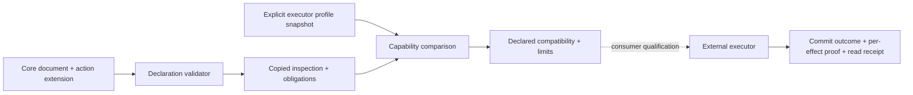

---
ddx:
  id: SD-008
  type: solution-design
  activity: design
  status: draft
  authoring:
    home: repo
  links:
    - id: FEAT-008
      kind: informed_by
    - id: umf.architecture
      kind: informed_by
    - id: CONTRACT-900
      kind: references
    - id: umf.concerns
      kind: references
    - id: ADR-002
      kind: references
---

# SD-008: Declarative action extension

**Feature:** [[FEAT-008-declarative-actions]].

## Scope

Use a module-scoped, independently versioned action extension. UMF owns portable
model validation/inspection and declared capability comparison. Consumer-owned
executors own authorization, state predicates, atomic writes and read receipts.
CONTRACT-900 owns the action surface; CONTRACT-901 owns the bounded proposed
consumer execution profile and protocol. This follows architecture's
extension/runtime boundary and introduces no persistent UMF service.

## Requirements Mapping

| Requirement | Design capability | Verification |
| --- | --- | --- |
| ACT-01 | Exact local references to existing core Records, Fields and stable Keys | US-900-AC1/8 |
| ACT-02 | Opaque, version-qualified rule envelope and failure identities; no evaluator | US-900-AC2/5 |
| ACT-03 | Separate semantic frames/postconditions and recipe/handler bindings; recipe dependency checks | US-900-AC3/8 |
| ACT-04 | Explicit executor obligations, separate from declaration validity | US-900-AC4/5 |
| ACT-05 | Inert named handler implementing a bounded contract | US-900-AC2/5 |
| ACT-06 | Source-retaining obligation inventory and per-declaration profile comparison | US-900-AC5/8 |
| ACT-07 | Existing serializer/registry, copied results and conservative action edits | US-900-AC6/8/9 |
| ACT-08 | Optional explicit DDD operation association with independent semantics | US-900-AC7 |

## Solution Approaches

**Selected: extension plus executor obligations.** It permits independent
versioning and partial understanding without changing core or DDD. Exact
per-declaration profiles are verbose but avoid claiming a coarse capability
flag supports every Key, constraint, expression and native side effect.

**Rejected: core action primitive.** No ideal-admission evidence justifies a
new core concept, and operational meanings differ by executor.

**Rejected: extend DDD operations as universal commands.** DDD is optional and
its existing operation shape has no mutation/effect enforcement semantics.

**Rejected: embed an evaluator or transaction engine.** This would select a
constraint language, state model and runtime beyond NFR-50. Describing a named
rule/handler keeps it discoverable without authorizing code.

**Architecture/ADR impact:** Add a proposed-extension boundary section to the
architecture. ADR-001/002 and core/DDD schemas remain governing. No new runtime
or datastore decision is required.

## Domain Model

An Action belongs to a module and refers to core definitions. Parameter values
carry Field identity; entity inputs carry selected Key identity. Conditions name
rule profiles and failures. Pre/postconditions and read/write frames declare meaning. Recipe bindings declare
ordered changes; later recipe bindings can
refer to earlier creates. An executor profile is a claim over an exact retained
declaration. It is distinct from a committed execution result or evidence proof.

## System Decomposition

US-900/TD-900 owns the package, portable declaration validator, copied APIs and
capability comparison. Core validators retain authority over Fields/Keys/values;
no action-specific numeric or key equality implementation is introduced.

The executor is an external integration boundary. It must qualify state reads,
role profile, handlers, native side effects, atomicity, replay and receipts
against CONTRACT-900 before claiming support. UMF does not supply its transport
or treat locator strings as authenticated evidence.

## Technology Rationale

Reuse the explicit Registry, portable JSON copying and JSON/YAML serializer.
Use TypeScript compiled to browser JavaScript with Bun tooling per ADR-002.
The package adds no database, process API, evaluator, network loader or auth
provider. Native grammar versions are not adopted by this authored profile.

## Concern Alignment

Fidelity/partial understanding requires source retention and blocking relevant
unknowns. Identity/composition uses local exact IDs and defers cross-document
resolution. Portable/bounded processing uses published limits and no runtime
callbacks loaded from documents. Conformance compares diagnostic sets and Bun/
Chromium behavior. Review/composability uses independent IDs, copied results and
whole-document validation with the caller's registry. Durable adoption requires
language-neutral fixture data and version-qualified claims. No concern departure
or additional exclusive slot is selected.

## Constraints and Assumptions

First profile is core 0.8.0, local-only, explicit-key recipe creates and unconditional
recipe effects. Handlers may branch or perform a business no-op within the declared
frame and postconditions; no arbitrary recipe branching language is introduced.
Generated/computed keys, owned/undirected executable
relationship behavior and unsupported value domains remain visibly unchecked or
out of scope. These limits make declaration tooling implementable before US-050.
Set semantics apply only to this action profile for associations lacking an
association Record; they do not settle broader core instance semantics.

## Traceability and Gaps

STP-900 allocates all nine story criteria to concrete planned tests. US-056, TD-056 and STP-056 allocate the complete bounded reference-consumer
journey, including EX-01–05 runtime witnesses. Consumer
execution witnesses are a separate gate and are not a passing library result.
CONTRACT-901 selects exact bounded rule/selector syntax, invocation variants and
handler-access requirements. Store adapters, policy/handler implementations and
sandbox qualification remain consumer-owned, unimplemented work. Broader proposal sections 2–6 (global conformance,
instance semantics, scalar coverage, canonical keys and authority) are not
silently adopted by this action slice.

## Risks

| Risk | Impact | Mitigation |
| --- | --- | --- |
| Compatibility report mistaken for execution proof | Unsafe writes | Explicit false execution-verification result and external witness gate. |
| Opaque expression treated as understood | Wrong state checks | Exact rule profile obligations; fail closed until qualified. |
| Native cascades/triggers escape effects | Undeclared changes | Refuse exact support without native side-effect evidence. |
| Mutable profile/source drift | Wrong contract invoked | Retain and compare exact declaration snapshot. |
| Excessive first-version restrictions | Limited consumer utility | Publish subset; extend versions with evidence rather than silently weaken it. |

## Iteration 2: closure of the system-comparison gaps

| Requirement | Selected design | Verification allocation |
| --- | --- | --- |
| ACT-09 | JSON-text typed AST with fixed operators; input-key-only selectors; no scans or arbitrary code | AC2/5/8 metadata; EX-01 |
| ACT-10 | Role/policy discriminated bindings; trusted context; first executor requires transaction-coupled authorization | AC4/5/8 metadata; EX-02 |
| ACT-11 | Immutable full-snapshot revision registry, retirement, authenticated lookup and expiry horizon | AC4/5 metadata; EX-02 |
| ACT-12 | Qualified invariant boundary; controlled handler capability plus ambient-access isolation; separate terminal audit and attempt telemetry | AC4/5 metadata; EX-03/05 |
| ACT-13 | Validation-only preview; explicit change review without automatic compatibility claims; composition deferred | AC4/5 metadata; EX-04/05 |

Only `umf.actions` is a new required UMF document extension. Rule/selector and
consumer protocol profiles have independent identities within its existing
obligations; implementation may provide portable static checking, but base UMF
never invokes stored rule/handler code. General authority, events and workflow
composition need demonstrated reuse before adding shared extensions.

The reference executor uses one transaction and may serialize per tenant to
make the first invariant boundary explicit. Finer locking is a later performance
change requiring new conflict evidence. A trusted unrestricted handler cannot
claim enforced frames. Sandbox/isolation design and native proof remain an
implementation prerequisite; the earlier sentinel experiment supplies neither.

### First handler isolation approach

Select a consumer-managed separate process with network disabled, no database
credentials/connections, no inherited secrets and no application filesystem
mounts. Its sole data channel is a bounded authenticated capability RPC to the
executor's transaction gateway. The executor remains responsible for every
frame/type/alias/relationship check; the process cannot submit arbitrary SQL.
An ordinary JavaScript worker with ambient network access does not meet this
boundary. The sandbox launcher and operating-system enforcement require native
qualification; this document selects the approach, not a delivered sandbox.
Process death/timeout aborts an uncommitted transaction; after uncertain commit
acknowledgement the executor reconciles the original key rather than guessing.

Limit RPC operations to 256 per attempt with payloads within core JSON limits;
exceeding that bound aborts. RPC request/reply schemas and authentication must be
specified in the separate executor technical design before implementation.

## Formal-analysis corrections

rules/1 now includes directed set-association membership so a handler contract
can distinguish created-but-unlinked records from its intended result. Alternate
Keys require native canonical identity resolution in the same transaction;
within-Key tuple equality alone is insufficient. Unknown/absent alternate-Key
creation refuses. Native schema-invariant checks have their own explicit complete
conflict boundary; they do not silently expand a handler's read capability.

Reservation intent requires positive quantity, sufficient stock, a fresh order
identity, exact stock subtraction and existence/status of the new reservation.
An equation alone is not a complete business contract. Formal semantic checks
keep permitted writes, stated postconditions and independent intent separate.
