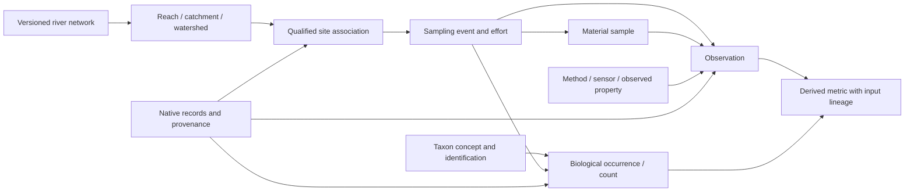

---
ddx:
  id: SD-024
  type: solution-design
  activity: design
  status: draft
  authoring:
    home: repo
  links:
    - id: FEAT-024
      kind: informed_by
    - id: umf.prd
      kind: informed_by
    - id: ADR-002
      kind: informed_by
    - id: umf.architecture
      kind: references
---

# SD-024: Ecology and water-management domain pack

**Feature:** [FEAT-024](../../01-frame/features/FEAT-024-ecology-domain-pack.md).
**Story:** [US-075](../../01-frame/user-stories/US-075-ecology-domain-pack.md).
**Scope:** Feature-level model and component proposal. Exact serialized schema/profile surfaces require a domain Contract and TD-075 using the integrated CONTRACT-052 baseline. This design remains draft and is not an implementation-ready claim.

## Scope

FR-45 owns portable pack/schema-tooling responsibilities. The shared foundation is [CONTRACT-052](../contracts/CONTRACT-052-domain-packs.md) in this repository; the ecology profile must reuse its source descriptors and bindings, extending domain semantics deliberately.

Encapsulate a river network, water-quality observations, aquatic biodiversity
surveys and fishing-related observations in one linked domain pack. Preserve
source-native profiles alongside the shared interpretation. UMF owns the
schemas, profile mappings and schema-generation tooling; TableSpec owns dataset
records, seeded generation, CSV ZIP serialization, loading and data tests.

US freshwater is a provisional pilot assumption. A first watershed, partner
question and actual source snapshots are not selected. The model can extend to
other geographies through independently pinned source profiles.

## Requirements Mapping

| Feature requirement | Capability | Component |
| --- | --- | --- |
| DOMAIN-01 | Inspect network, sites, events, results, taxonomy and effort together | Schema assembly |
| DOMAIN-02 | Preserve spatial support, time, methods, qualifiers and native residuals | Shared model plus native profiles |
| DOMAIN-03 | Demonstrate matched observations and a censored/unresolved counterexample | Pilot corpus |
| DOMAIN-04 | Describe network size, history, telemetry frequency and survey density | Declarative scenario metadata; TableSpec generator |
| DOMAIN-05 | Retain originals, mappings, source snapshots and redistribution terms | Source/provenance inventory |
| DOMAIN-06 | Answer a watershed-linked domain question with an independent expected result | Qualified consumer projection |

NFR-1/2/8/23/25/27/40 require native preservation and explicit interpretation
limits. NFR-5/6/10 govern source-qualified identity and versioned joins.
NFR-11/26/32/33 require offline supplied inputs and bounded processing without
artifact-supplied execution. NFR-50 keeps hydrologic/ecological computation and
data loading in consumers. Resource budgets remain to be measured in the TD/STP.

## Solution Approaches

### One wide river-sample table

Simple to load, but repeating location, taxon and method data obscures identity,
forces unrelated sensor/lab/survey meanings into nullable columns, and loses
network and provenance distinctions. Rejected as the authoritative model;
a bounded wide view may be generated for a specific consumer question.

### Independent source tables only

Preserves native inputs, but every consumer must reimplement location, time,
method and taxonomic relationships. Retained native tables remain part of the
pack, but this alone does not meet the shared metadata-consumer outcome.

### Linked shared model with native profiles

Proposed approach: use shared spatial features, events, observations and
provenance for explicit joins, with typed domain details and source residuals.
This adds mapping work but preserves disagreements and enables multiple
consumer views. Do not normalize a meaning until its correspondence is defined.
No new UMF core primitive or governing DDD worldview is proposed.

**Architecture/ADR impact:** Uses existing core plus extensions and independent
bindings under ADR-002. Cross-document reuse must reconcile FEAT-007 and
CONTRACT-045; grouping several schemas in one pack does not itself authorize
new external-reference behavior.

## Domain Model

The following are conceptual entities and associations, not normative field
names or physical tables. Keys, types, cardinalities and exact shapes belong
in the domain Contract. A singular conceptual association does not imply every
source supplies it or that matching is certain.

| Concept | Meaning and retained context |
| --- | --- |
| Spatial feature | Watershed, local catchment, reach, waterbody or habitat; geometry, coordinate reference, uncertainty and source framework |
| Network relationship | Directed reach connectivity and catchment/reach associations, with source version and relationship authority |
| Monitoring site | A source-qualified collection location associated with a feature through an explicit sourced or proposed match |
| Project and sampling event | Study/visit and event context; time or interval, protocol, effort and spatial extent |
| Sample | Collected material or subsample, matrix and lineage; absent for some direct sensor observations |
| Observation | A property evaluated for a subject/feature/event, with result kind, units, procedure, phenomenon time, result time and quality |
| Series and sensor | Repeated observations sharing declared parameter/statistic and procedure; calibration and revisions remain attributable |
| Typed result detail | Chemistry/lab, sensor, habitat, biodiversity or fishing-specific meaning without flattening every value into a number |
| Taxon concept and identification | Source/version-qualified taxonomic concept and identification assertion; name, rank, life stage and uncertainty remain separate |
| Occurrence and count | Detection/non-detection or abundance observation tied to event and effort; opportunistic records remain distinguishable |
| Fishing event | Trip/survey context, effort, gear and catches where published or synthetic; not automatically a scientific population survey |
| Management intervention | A dated action affecting a feature with source intent/provenance; an action alone establishes no measured causal effect |
| Source record and derivation | Publisher, snapshot, native identity, checksum, rights and transformation/input lineage for every mapped or derived assertion |

### Business Rules

1. **Spatial support:** A site's point, a reach, a local catchment and its full
   upstream watershed remain separate. Retain the actual area of support for a
   metric. Upstream traversal uses a pinned directed network; flowlines cannot
   be assumed acyclic or strictly single-downstream in every source.
2. **Identity:** Namespace source IDs with publisher, dataset/product and
   relevant revision context. Retain original identifiers. A USGS location
   mirrored through the Water Quality Portal requires a documented identity
   mapping; coordinates or matching names alone cannot deduplicate it.
3. **Cross-framework mapping:** StreamCat's NHDPlusV2 reach associations are
   not automatically NHDPlus HR or 3DHP associations. Retain sourced crosswalks
   or explicitly uncertain spatial matches with their algorithm, evidence and
   version. Unresolved joins remain visible.
4. **Observation meaning:** Preserve measured property, sample matrix,
   fraction/basis, method, unit and qualifiers. Total and dissolved analytes
   are distinct. Unit conversions require compatible meanings and retain
   original value/unit plus the conversion provenance.
5. **Censoring:** A below-detection result retains its threshold, qualifier and
   any original result text. It never becomes zero or an invented midpoint.
   Missing, invalid, rejected and not-measured remain distinct where supplied.
6. **Time:** Retain phenomenon time/interval, result/report time, timezone and
   source precision. Instantaneous readings, daily means and sample results do
   not become one undifferentiated series. A time-window match is a derived
   association with explicit rules, not an asserted simultaneous measurement.
7. **Taxonomy:** Preserve original identification and accepted concept mappings
   separately. A genus/family identification is not silently expanded to a
   species. Taxonomic revisions and uncertain life-stage identifications retain
   provenance. The pack does not invent a global taxonomy authority.
8. **Sampling:** Count and abundance interpretation requires protocol, effort,
   area/volume or other sampling basis. Missing occurrence records are not
   absence. A complete survey's explicit non-detection retains its protocol.
   Trap counts, benthic samples, visual sightings and angler catches are not
   directly interchangeable abundance measures.
9. **Derived metrics:** Species richness, insect-group composition, catch per
   effort and condition indexes declare algorithm/version, applicability,
   denominator and inputs. Unknown effort or incompatible method blocks a
   quantitative comparison. Physical association is not a causal conclusion.
10. **Rights and sensitive data:** Preserve publisher license/attribution and
    supplied coordinate generalization/uncertainty. A redistributable fixture
    subset requires compatible terms. Synthetic locations and organisms have
    distinct identities/origins and cannot masquerade as observed populations.

## Source Profiles

NHDPlus is the National Hydrography Dataset Plus framework; HR means high resolution. WQX is EPA's Water Quality Exchange. 3DHP is the USGS 3D Hydrography Program. Each is identified separately in a source profile.

| Candidate profile | Proposed role | First mapping boundary |
| --- | --- | --- |
| [USGS water](../../00-discover/resources/ecology-usgs-water.md) | Sites, series, flow/temperature/other sensor observations | Pin API schema and response snapshots; retain parameter/statistic, unit and quality distinctions |
| [Water Quality Portal / WQX](../../00-discover/resources/ecology-water-quality.md) | Sampling activities, samples, chemistry and biological results | Pin selected WQX 3 profile/export; retain detection, method and result qualifiers |
| [Darwin Core](../../00-discover/resources/ecology-darwin-core.md) | Events, taxonomic identifications, aquatic insect/fish occurrences and effort | Pin vocabulary revision and publisher dataset; distinguish occurrence-only records from quantitative sampling |
| [EPA StreamCat](../../00-discover/resources/ecology-streamcat.md) | Landscape/habitat context | Pin metric release, year and spatial support; retain NHDPlusV2 association |
| [USGS hydrography](../../00-discover/resources/ecology-hydrography.md) | Versioned river topology and catchment geometry | Select one actual framework; crosswalks require independent evidence |
| [EPA aquatic surveys](../../00-discover/resources/ecology-nrsa.md) | Published benthic-invertebrate/fish survey fixtures | Retain companion metadata, survey/method and any weights before interpretation |
| [OGC SensorThings 1.1](../../00-discover/resources/ecology-sensorthings.md) | Reference for feature/property/procedure/time structure | Reference model only initially; no SensorThings API interoperability claim |
| [GBIF reuse](../../00-discover/resources/ecology-gbif-reuse.md) | Biodiversity dataset publication constraints | Select specific dataset/terms; preserve supplied location restrictions |

No live ingestion service is added by these plans. Record publisher URL/query,
release or retrieval time, checksums and selected subset in the fixture inventory.
Source harvesting and live synchronization require separate consumer work.

## System Decomposition

| Component | Responsibility | Owner and design handoff |
| --- | --- | --- |
| Schema assembly | Versioned shared entities, typed domain profiles and portable schema output | UMF; TD-075 after shared pack Contract |
| Source mapping | Attribute known meanings and retain native records/residuals; explicit crosswalks and uncertainty | UMF mapping semantics/tooling; consumer supplies source bytes |
| Scenario metadata | Describe coherent domain scenarios and scale axes using declarative generator references | UMF schema/profile metadata; exact surface in Contract |
| Dataset generator | Generate labeled records, seeded correlations and CSV ZIP; stream large scales | TableSpec; its own design/test/build artifacts |
| Consumer views | Join qualified sites, network, time windows and comparable methods with visible exclusions | TableSpec and later Truss/Ashlar; independent target profiles |
| Acceptance corpus | Small originals/projections/synthetic scenarios and independent expected answers | UMF schema evidence plus TableSpec data/engine evidence |

**CSV shape:** Propose separate related files for spatial features/network,
sites, events/effort, samples, observations, typed result details, taxonomy,
occurrences, fishing and provenance. Generate wide analytical views from these
relations for a named question. The shared archive Contract must define exact
file names, geometry carrier, keys, units, null encoding and versioning before
implementation; CSV alone cannot carry all schema meaning.

## Pilot and Traceability

First question: **For one selected watershed, which qualified sites have water
observations and aquatic-insect samples in a stated period, and what methods,
effort, result qualifiers and match limitations accompany each comparison?**
The partner should review that question and a real-data subset before broader
water-management outcomes are added.

| Requirement / AC | Design element | Verification intent |
| --- | --- | --- |
| DOMAIN-01 / US-075-AC1 | Shared network/event/observation/taxon model | Generate/inspect schema inventory in Bun and Chromium |
| DOMAIN-02, DOMAIN-03 / AC2–AC3 | Qualified joins and typed result details | Two connected reaches; explicit sampling effort; censored nitrate; unresolved nearby site; independent expected joins |
| DOMAIN-04 / AC4–AC5 | Scenario metadata and trusted TableSpec generator | Replay seed 42; vary site/event density and history; validate labeled violations and measure resources |
| DOMAIN-05 / AC6–AC7 | Retained sources and typed archive profiles | Exact value/qualifier/identity read-back and origin reconstruction |
| DOMAIN-06 / AC2, AC8 | Consumer views and comparability policy | Compare known matches; exclude unresolved site/time/method matches visibly |

Add a known-effort zero-detection control, an effort-unknown positive occurrence,
a genus-only identification, two incompatible spatial frameworks, a daily-mean
versus instantaneous observation and synthetic fishing catches. An independent
expected answer must say which comparisons are supported and which remain
incomplete. STP-075 will allocate every criterion to named exercising tests.

## Concern Alignment

Selected concerns apply unchanged: fidelity preserves native residuals;
identity/versioning qualifies network, taxa and joins; reproducibility pins
inputs; bounded processing prohibits artifact-driven fetching/execution;
conformance separates source-schema support from biological comparability;
review preserves inspectable profiles; runtime boundaries keep data execution
in consumers. ADR-002 governs portable schema tooling. No departure or new
language/runtime choice is proposed.

## Constraints and Assumptions

The pilot geography is provisional. No selected real dataset, taxonomic
backbone, scientifically validated generator or native profile conformance is
claimed. Entomology initially means aquatic biodiversity sampling, with a
benthic macroinvertebrate scenario; emergence/adult insect or hatch observations
may be added as an independently described profile. Fishing observations need
an identified source/method before any real fixture joins the catalog.

## Risks and Open Decisions

| Risk / decision | Consequence | Next resolution |
| --- | --- | --- |
| Partner region/question unselected | Source subset may be irrelevant | Confirm geography and review pilot question |
| Shared baseline integrated; domain profiles unfinished | Exact schema/API shapes are unresolved | Reuse shared pack/source interfaces, then domain Contract and TD-075 |
| Duplicate/mirrored sites or cross-framework mismatch | False joins | Preserve source identity; test sourced crosswalks and unresolved cases |
| Incompatible methods, taxonomy or units | Misleading comparisons | Explicit comparability profile and independent negative cases |
| Synthetic seasonal correlations look scientific | Unsupported biological conclusions | Label illustrative parameters and require expert calibration for realism claims |
| Source terms or sensitive location limits | Unpublishable or misleading fixture subset | Retain terms and select a compatible published subset |

Before implementation: choose the initial source snapshots, identity/matching
policy, geometry carrier, taxonomy subset and result profile; author the domain
Contract, TD-075 and STP-075. Broader forecasting, hydrologic models and management
execution remain separate consumer capabilities.
