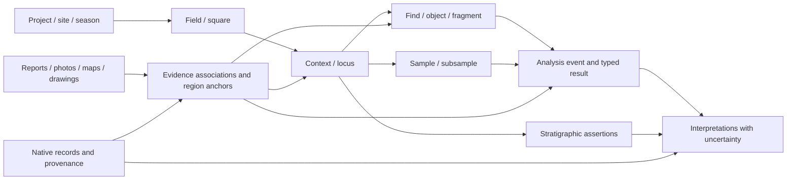

---
ddx:
  id: SD-025
  type: solution-design
  activity: design
  status: draft
  authoring:
    home: repo
  links:
    - id: FEAT-025
      kind: informed_by
    - id: umf.prd
      kind: informed_by
    - id: ADR-002
      kind: informed_by
    - id: umf.architecture
      kind: references
---

# SD-025: Archaeology domain pack

**Feature:** [FEAT-025](../../01-frame/features/FEAT-025-archaeology-domain-pack.md).
**Story:** [US-076](../../01-frame/user-stories/US-076-archaeology-domain-pack.md).
**Status:** Draft feature-level proposal; exact profile surfaces and implementation require the archaeology Contract, TD-076 and STP-076.

## Scope

Model excavation context, recorded evidence, material samples, specialist analyses
and revisable interpretations as linked information. FR-45 assigns schemas and
schema tooling to UMF; TableSpec owns generated tabular datasets and testing.
Shared [CONTRACT-052](../contracts/CONTRACT-052-domain-packs.md)
is integrated; reuse its source descriptors and bindings before defining archaeology-specific profile interfaces.

First native candidate: Madaba Plains Project–Tall al-ʿUmayri. Inspect actual
records before asserting complete coverage of pottery, soil, fauna or media.
Other projects retain independently versioned recording conventions.

## Requirements Mapping

| Requirement | Capability | Component |
| --- | --- | --- |
| DOMAIN-01 | Linked excavation and specialist inventory | Schema assembly |
| DOMAIN-02 | Native identifiers, stratigraphic assertions and interpretation lineage | Source profiles and assertion model |
| DOMAIN-03 | Positive evidence chain and contradictory sequence | Small acceptance corpus |
| DOMAIN-04 | Independently varied sites, contexts, finds, analyses and assets | Declarative scenario metadata; TableSpec generator |
| DOMAIN-05 | Published originals, projections, synthetic cases and reuse terms | Provenance/source inventory |
| DOMAIN-06 | Context-to-evidence question with independent expected result | Qualified consumer view |
| ARCH-01 | Multi-subject reports, photos, maps and drawings with version/region references | Evidence assets and association model |
| ARCH-02 | Distinct pottery, soil and fauna results with specimen/method lineage | Typed analysis profiles |

NFR-1/2/8/25/40 preserve native and unknown meaning; NFR-5/6/10 preserve
source-qualified identity and revisions; NFR-26/27 preserve reproducibility and
lineage; NFR-32/33 bound processing and prohibit artifact-driven execution;
NFR-50 keeps business/data execution in consumers. Quantitative resource budgets
are downstream design inputs, not implied by a scale preset.

## Solution Approaches

### One object catalog with document attachments

Easy to browse, but gives finds privileged status and obscures excavation
contexts, bulk samples, stratigraphic assertions and cross-cutting evidence.
Rejected as the authoritative model; an object-centered view may be generated.

### Mandatory archaeological ontology

Provides rich terminology, but requires every pack consumer to adopt the same
ontology and interpretation machinery. Use CRMarchaeo as a mapping reference
within a pinned profile; ontology participation stays optional.

### Context-and-evidence graph with typed records

Proposed approach: related schemas for spatial/excavation entities, finds and
samples, evidence assets, analysis events/results and interpretation assertions.
Native source profiles retain local terms and residuals. Consumers generate
relational CSV views or graph projections from the same authored identities.
This supports the complete evidence journey while retaining competing readings.

**Architecture/ADR impact:** Existing core plus independently versioned
extensions/bindings; no new universal core primitive or DDD requirement.
Cross-document reuse must reconcile FEAT-007/CONTRACT-045. ADR-002 continues to
govern portable schema tooling and actual-browser checks.

## Domain Model

Concepts below define the proposed meaning and relationships, not serialized
field names, physical tables or a claim of native schema equivalence.

| Concept | Responsibility |
| --- | --- |
| Project, site and season | Excavation/study organization, place and campaign identity; a season is not an occupation date |
| Field/area, square and context/locus | Recording spaces and investigated features/deposits; source-native codes, geometry and datum retained |
| Excavation activity | Work that exposes/removes/records a portion of context, linked to participants and documentation |
| Stratigraphic assertion | Attributable relation between contexts/features with observation/evidence and interpretation status |
| Find/basket/lot and object/fragment | Recovery grouping versus physical item; refits and reconstructed vessels remain separate associations |
| Sample and subsample | Collected material, provenance, preparation and chain of subdivision/destructive analysis |
| Analysis event and typed result | Method, analyst, subject, time, units and uncertainty; pottery, soil/sediment and fauna remain distinct profiles |
| Field report/document | Narrative or tabular evidence with author, revision, citation and page/section anchors |
| Evidence asset | Photo, map, square plan, section drawing, object drawing or other digital content, with creator/source/revision and availability |
| Evidence association | Many-to-many asset/document-to-subject link; depicts, documents, analyzes and supports retain different meanings |
| Interpretation assertion | Typology, phase, date or function interpretation with author/method/evidence and revision history |
| Source/derivation | Native record, publisher, stable reference, snapshot, checksum, terms and mapping/generation lineage |

The square-to-context line is a recording association, not universal physical
containment. Contexts may cross square boundaries; a source's sheet records may
refer to the same context over multiple activities or seasons. Cross-source
identity reconciliation requires evidence and retains uncertainty.

### Business Rules

1. **Context identity:** Qualify square/locus/object numbers by their source
   scope. A repeated local label at another site is a different identity.
   Retain sheet/record identity separately from the physical feature it describes.
2. **Observed versus interpreted:** Recorded geometry, material and recovery
   context remain distinct from proposed phase, function, date and cultural
   attribution. Superseding an interpretation retains its earlier evidence and author.
3. **Stratigraphy:** Distinguish containment, observed spatial relations and
   interpreted chronological precedence. Diagnose contradictions in a selected
   precedence profile without deleting assertions. Do not assume discovery order
   or locus numbering is chronological order.
4. **Spatial meaning:** Maps, square plans and sections retain grid, datum,
   scale, orientation, coordinate reference and uncertainty when supplied.
   An object drawing's scale does not georeference it. An absent grid transform
   remains unknown rather than becoming a guessed world coordinate.
5. **Temporal meaning:** Excavation/report dates and estimated ancient dates
   are separate. Period labels and uncertain ranges retain the source calendar,
   convention and dating basis. Radiocarbon evidence, if added, requires its
   own method/calibration profile; no silent conversion to a modern timestamp.
6. **Material lineage:** Finds, bulk lots, individual fragments, reconstructed
   vessels, soil samples and animal remains retain their own identities. Record
   refits/subsamples and destructive preparation with explicit derivation links.
7. **Specialist analyses:** Pottery form/fabric/typology and counts/weights;
   soil/sediment composition and preparation; faunal taxonomy, element, taphonomy
   and quantitative measures are separate result profiles. Number of identified
   specimens, minimum estimated individuals, sherd counts and estimated vessels
   retain methods and denominators; they cannot be added as one generic count.
8. **Media evidence:** Keep binary content identity separate from its catalog
   record, derivative thumbnails and subject associations. A report may cite a
   photo; a drawing may depict multiple contexts or an object fragment. Preserve
   page/figure/region anchors and uncertainty; document extraction or OCR, if
   added, is a derived assertion linked to the original.
9. **Publication:** Native data, report text and media can have different
   terms. Preserve actual per-item attribution. Missing bytes or external-only
   references remain explicitly unavailable/external, never falsely included.
10. **Synthetic scale:** Invented excavations retain separate IDs and origin.
    Ground-truth stratigraphy and analysis labels belong to the scenario, not
    historical assertions about the real Madaba Plains site. Fixture images or
    drawings must be labeled as published originals, derivatives or synthetic
    illustrations according to what they actually are.

## System Decomposition

| Component | Responsibility | Ownership / interface handoff |
| --- | --- | --- |
| Native source inventory | Pin record subset, project terms, citations and asset availability/rights | UMF fixture/mapping definitions; host consumer supplies bytes |
| Schema assembly | Context, specimens, analyses, assertions and evidence associations | UMF; archaeology Contract and TD-076 |
| Media/document profile | Asset identity, subject links, revisions, geometry/page anchors and inclusion rules | UMF metadata/profile; exact archive surface in Contract |
| Dataset generator | Seed coherent synthetic contexts/material/results and labeled contradictions | TableSpec; explicit trusted generator registry |
| Archive and ingestion | CSV typed values, referential integrity and optional content manifest read-back | TableSpec; separate engine and media evidence |
| Consumer view | Resolve the context-evidence question and show excluded/uncertain associations | TableSpec, later independently qualified graph consumers |

CSV exports should contain related records for contexts, finds, samples,
analyses/results, documents, assets and associations. Photos, PDFs and drawings
remain referenced content with a media inventory; they are not coerced into
CSV text. An optional asset bundle needs a separately specified archive profile
covering paths, checksums, size bounds and terms. A CSV-only release explicitly
states whether each reference is included, external or unavailable.

## Source Profiles

| Source | Proposed use | Verified boundary |
| --- | --- | --- |
| [Madaba Plains/Open Context](../../00-discover/resources/archaeology-mpp-open-context.md) | First source identity, record inventory and linked-table candidate | Project JSON and metadata read; individual table/asset coverage is not fully inventoried |
| [Excavation manual](../../00-discover/resources/archaeology-mpp-manual.md) | Source recording vocabulary and context/evidence distinctions | Source-specific method; mapping still needs actual records |
| [Publication series](../../00-discover/resources/archaeology-mpp-publications.md) | Reports, plans/maps, pottery plates and specialist documentation | Publication inventory; not a parsed structured/media fixture corpus |
| [Open Context API](../../00-discover/resources/archaeology-open-context-api.md) | Native JSON-LD snapshots and linked record/media mapping | Preserve native JSON-LD contexts/dependencies; no implicit network resolution |
| [CRMarchaeo 2.1](../../00-discover/resources/archaeology-crmarchaeo.md) | Excavation/stratigraphic mapping reference | Optional future mapping; no conformance/equivalence claim |

## Traceability

| Requirement / AC | Design element | Verification intent |
| --- | --- | --- |
| DOMAIN-01 / US-076-AC1 | Context/material/evidence schema inventory | Bun/Chromium schema generation and inspection |
| DOMAIN-02–03 / AC2–AC3 | Evidence chain and retained stratigraphic assertions | Known context links; explicit precedence contradiction |
| DOMAIN-04 / AC4–AC5 | Scenario metadata and trusted generator | Replay seed 42; increase context/find/media density; integrity/resource reports |
| DOMAIN-05 / AC6–AC7 | Typed archive and source profiles | Exact identity/value read-back; separate real/synthetic provenance |
| DOMAIN-06 / AC2, AC8 | Qualified context-evidence view | Independent expected joins and unknown-meaning refusal |
| ARCH-01 / AC9 | Assets, subject associations and region anchors | Multi-subject drawing, included checksum and unavailable-content control |
| DOMAIN-02 / AC10 | Dating interpretations | Two uncertain overlapping interpretations remain attributable |
| ARCH-02 / AC11 | Typed analyses and specimen lineage | Pottery count, soil fraction and faunal specimen measure remain distinct |

## Concern Alignment

Fidelity and partial understanding preserve source terms and competing
interpretations. Identity/versioning separates local labels, context records
and physical items. Reproducibility pins snapshots and generators. Bounded
processing constrains source/media handling and prohibits artifact execution.
Conformance separates schema, native mapping, data correctness and historical
interpretation. Review keeps domain profiles inspectable. Runtime boundaries
retain TableSpec data execution and optional independent graph projections.
ADR-002 remains the runtime authority; no departure is proposed.

## Constraints, Assumptions and Risks

- The first source subset and scientific/domain reviewer remain unselected.
- Public project metadata and publications substantiate a source candidate;
  availability of every requested soil/fauna/pottery table is still unknown.
- Local numbering, dating conventions and grids require actual source examples
  before a normative profile can be written.
- A source interpretation or source contradiction must remain attributable;
  structural correctness alone cannot certify historical truth.
- Asset rights, missing bytes and document anchors require item-level inventory.
- Exact schema/API/media-archive surfaces require the archaeology Contract,
  TD-076 and STP-076 after shared CONTRACT-052 baseline.
