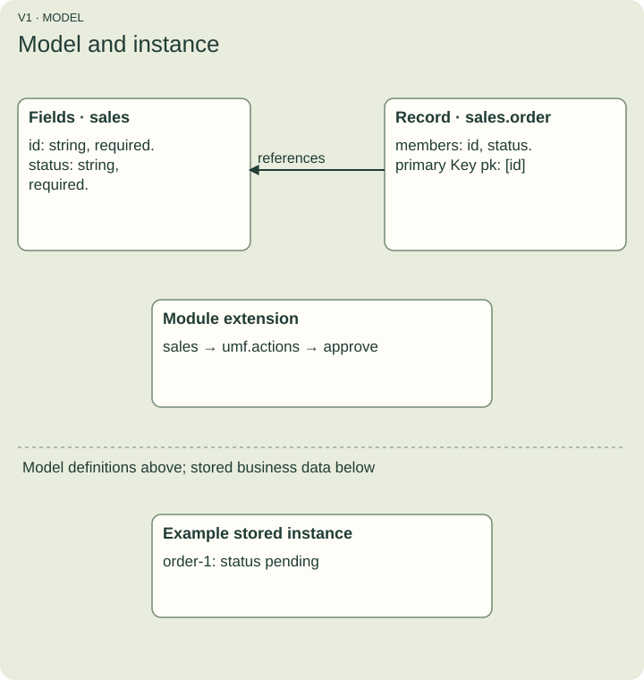

# Meet the model

A stored order might contain an identifier and a status. UMF describes what those values mean and how they are organized; it does not contain that database row.

A **Field** describes a value, such as a required string status. A **Record** groups Fields into an entity shape, such as an order. A **Key** identifies an instance using an ordered tuple of Fields. A **module** groups definitions and supplies the first part of their exact identity. Display names are not identities.

Figure V1. The actual approve fixture defines sales.id, sales.status and sales.order, with primary Key pk. The example stored order is separate business data. The action attaches to the module extension, not to that row.

## What an extension adds

An extension adds versioned meaning without changing the core model. The document declares umf.actions 0.1.0 and puts its action list under a module's extensions. Registering this package teaches a Registry how to check that vocabulary. It does not grant roles or install handlers.

Unknown extension content is retained. **Valid** means no known errors were found. **Complete** means all declared content was interpreted. A document can be valid and incomplete at the same time.

## Library and consumer

The portable library reads, validates, copies, inspects and compares declarations. Its inspection operations do not evaluate business state, authenticate callers or write orders. Separate explicit interpreter functions compile or evaluate supported expressions using state supplied by a consumer.

The host-only reference consumer authenticates callers, checks current permissions, resolves selected identities, executes inside a native transaction and retains outcomes. It lives in scripts/actions-reference, outside the browser library. The consumer must qualify the exact declaration and environment before execution.

## Predict the result

If inspection reports a literal assignment of approved to status, has an order been approved?

Answer: no. You have read a declaration of the intended change. A separate consumer must execute it against an authorized store.
