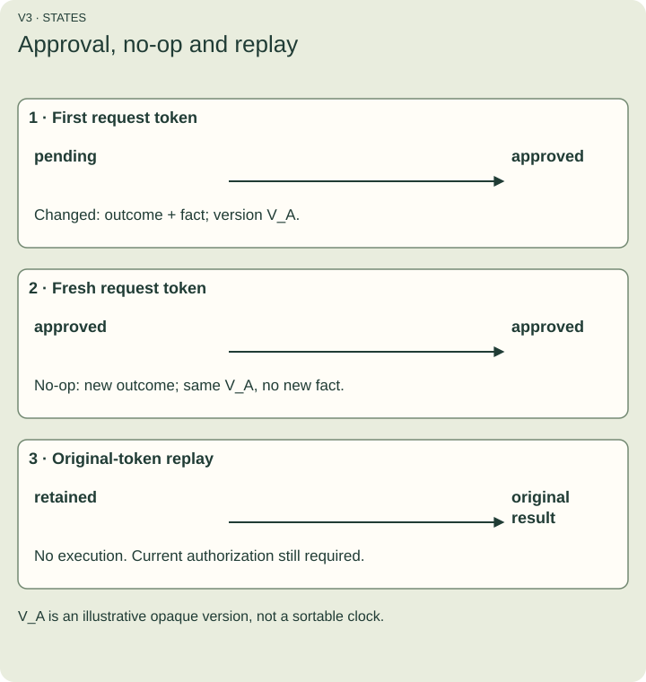
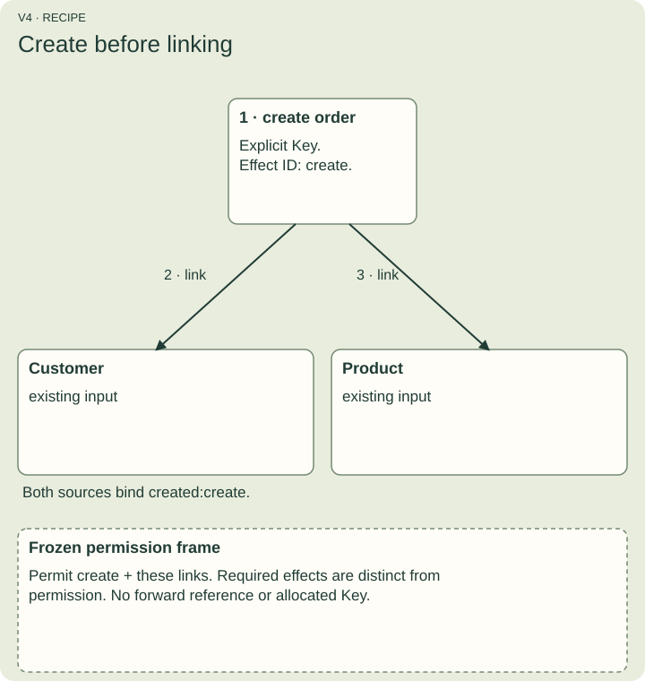

# Describe a change precisely

An action names typed parameters, possible failures, conditions, permitted reads and writes, authorization and a recipe or handler binding. Empty lists explicitly mean no declared entries; missing members are not defaults.

## Start with approval

The approve fixture has one required entity parameter. It selects a sales.order by Key pk, freezes that selection, and permits writing its status Field. Its recipe requires a SET to approved. Permission to write a Field does not grant permission to read it.

Figure V3. First approval changes pending to approved. A fresh keyed invocation on the approved order is a business no-op with a new terminal outcome but no new business-change version or event. An identical-token replay returns the original outcome; it is not a new execution.

## Recipes have ordered required effects

Graph-write/1 supports create, set, delete, link and unlink. An effect can refer to an entity created by an earlier effect. Forward and self-created references refuse. Keys are immutable, identity allocation is not supported and deletes do not imply cascades.

Figure V4. The actual create-link fixture first creates the order at an explicit Key, then links that created order to customer and product. The diagram does not imply a database cascade or computed identifier. See fixtures/actions/create-link.json.

## When a handler is needed

A **frame** lists selected identities and permitted access. A handler can branch or make no business change while satisfying its outputs, postconditions and frame. A frame alone cannot express a mandatory effect.

The initial recipe can assign a parameter or a literal. It cannot compute new stock from stored stock minus quantity. A separately qualified handler can perform that computation. The explicit rules/1 interpreter can express exact integer arithmetic predicates to check it; predicate support is different from recipe assignment support.

## Check a concrete postcondition

Run `bun run docs:example:rule` for a separate strengthened declaration in fixtures/actions/tutorial-postcondition.json. It explicitly adds a READ selection for status, selects the known roles/1 profile, and declares an approved-status postcondition. The original approve fixture remains unchanged.

The rule expression is JSON text describing equality between the selected post-state status and the literal approved. Its declared references name the order Record. scripts/actions-docs/rule-example.ts compiles it, supplies illustrative pre/post state, and verifies true for approved and false for pending. It writes no order and does not authenticate that supplied state. A consumer would enforce the rule before commit; false postconditions roll back rather than create a durable business rejection.

## Preserve unknown meaning

Unknown members and future effect kinds survive inspection and serialization. Their relevant unchecked meaning blocks safe edits and compatible assessments. Unsupported native relationships must refuse rather than quietly becoming ordinary links.

## Predict the result

If a handler has permission to write status but validly leaves it unchanged, has it violated that permission?

Answer: no. A permission bounds what may happen. Required recipe effects and postconditions specify what must happen.
