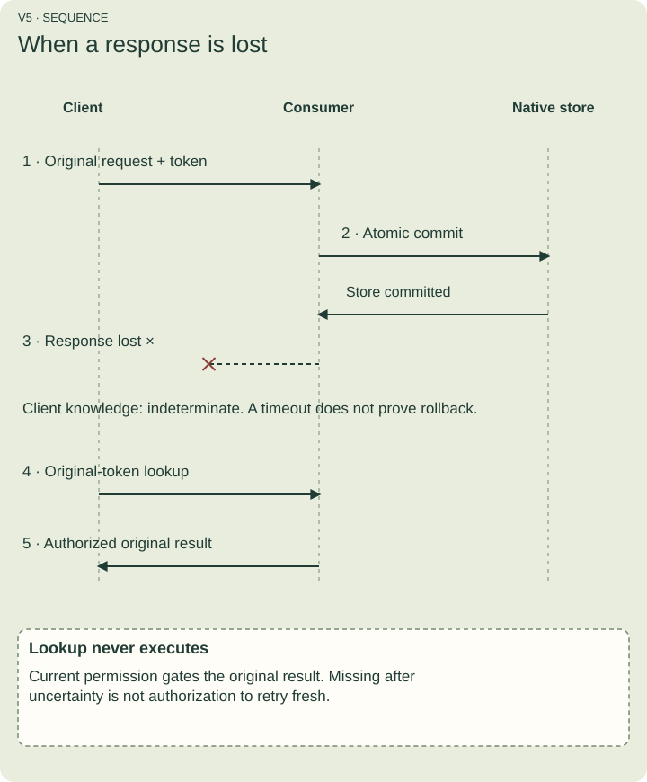
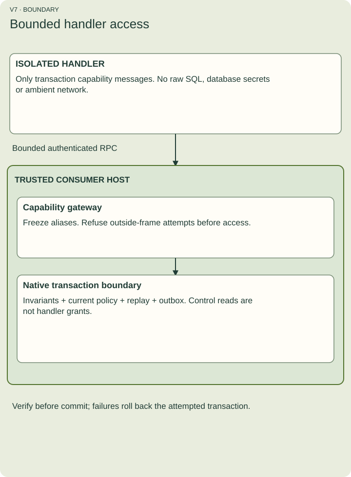

# Follow a consumer execution

A **command** requests a change. The reference consumer decides whether it can commit that change. It authenticates the human principal and calling service using trusted host state; request fields cannot impersonate either.

## Try the optional native example

Start a local Docker daemon and install Bun 1.4.2. From the prepared repository, load the qualified Linux ARM64 PostgreSQL image and give it the tag used by the tutorial harness. The final command starts its own PostgreSQL 17.9 container, seeds synthetic data, executes approval, checks native rows and cleans up its own store and container in a finally block.

```sh
docker pull --platform linux/arm64 postgres@sha256:2a0d0fe14825b0939f78a8cad5cd4e6aa68bf94d0e5dd96e24b6d23af4315545
docker tag postgres@sha256:2a0d0fe14825b0939f78a8cad5cd4e6aa68bf94d0e5dd96e24b6d23af4315545 postgres:17.9
bun run docs:example:native
```

This pinned reference runtime is qualified on ARM64. Other platforms need their own runtime qualification; the portable declaration example remains independent of Docker.

The full executable source is scripts/actions-docs/native-example.ts. It copies approve.json and explicitly changes its opaque authorization profile to umf.actions.roles/1. That copy is a new declaration retained as tutorial-r1. It provisions current approver membership and a separate replay-discovery policy. Neither role is granted by the document itself. The walkthrough makes two real approvals, replays an original result, observes a fresh-token no-op, and checks that a false postcondition discards a tentative SET before SQL persistence. It then injects an audit-table constraint failure after business writes and verifies PostgreSQL rolls back the entity rows, receipts, business sequence, outcomes and outbox facts. A false precondition instead creates a durable rejection that replays. It delivers projection event 2 before event 1, observes pending visibility, closes the gap, and compares the visible graph against independently queried PostgreSQL rows. Final counts are four outcomes and two outbox facts.

The example verifies committed approval, one original-token replay, a fresh-key no-op, unchanged business version for that no-op and denial after role revocation. It independently reads the native order and control tables. It uses only synthetic credentials and localhost; never point it at a user database. The harness throws on readiness/version failure and removes only its own UUID-named container. It does not install a hosted executor.

## Preview is not a reservation

Preview checks current input, policy and preconditions without running the handler or writing business, replay, audit or outbox state. Rejected preview conditions remain a preview result. A successful preview promises no future commit; invocation rechecks state.

## Understand outcomes

- committed: the transaction succeeded, including verification and its terminal outcome.
- rejected: an admitted invocation found a false business precondition or missing entity; a keyed rejection is retained without business changes.
- conflict: an expected-version mismatch or token reuse prevents the requested change.
- denied, unsupported, expired: the consumer refuses under the stated policy/profile/horizon.
- failed: execution is known to have rolled back; it has no terminal business outcome.
- indeterminate: the client does not know whether commit occurred, such as after a lost response.

Output, access, final-constraint, rule-evaluation or postcondition failure rolls the attempted transaction back. Expected-version checks precede preconditions; final constraints precede postconditions. The first failing stage determines the outcome.

## Reconcile a lost response



Figure V5. Keep the original token, declaration revision, typed inputs and expected versions. Lookup checks current permissions and returns the retained original result without execution. A missing result does not authorize reexecution after uncertainty. Without a key, this profile offers no keyed at-most-once recovery guarantee.

Replay identity includes tenant, store, principal, module/action and caller token. Revision belongs to the compared payload, not the lookup namespace. Correlation and calling service are not replay identity. Retirement stops fresh admission but can preserve original interpretation and protected replay; replay does not require the old executable handler.

## Understand handler isolation



Figure V7. A handler receives bounded transaction capabilities through a controlled gateway. It receives no database connection or ambient network credentials. The consumer owns native invariant checks, authorization, replay and outbox maintenance. Those control reads never become handler permissions.

The reference profile serializes a store through a control lock. Arbitrary outside writers, new triggers, broader concurrency, external effects and cross-store commits require new qualification.

## Recover an unresolved handler launch

A handler launch has a durable ownership record: the consumer records which container it owns before starting it. If launch or cleanup cannot be confirmed within the profile's limits, the reference consumer returns LIMIT and keeps new handler admission closed. A restart does not erase that record. Even an absent container is insufficient evidence that the ownership record was reconciled.

The recovery demonstration uses real Docker containers. Install Bun 1.4.2 and the Docker CLI, start a local Docker daemon with a Unix socket, and run these commands from the repository root. The qualified handler image is Linux ARM64; the reference profile requires this exact image and does not substitute another platform.

```sh
bun install --frozen-lockfile
docker info
docker pull --platform linux/arm64 mcr.microsoft.com/playwright@sha256:eff16c30e6f3f4af0a03fa4b706120d5e9b0891c344a27d64559aff5900a4a27
docker image inspect sha256:eff16c30e6f3f4af0a03fa4b706120d5e9b0891c344a27d64559aff5900a4a27
bun test tests/actions-reference/launch-owner.test.ts
```

The image inspection must report Os as linux and Architecture as arm64. Run the test suite serially against this daemon: the qualified consumer admits one handler launch at a time. Docker Desktop provides a local daemon on macOS; a remote TCP Docker endpoint is outside this reference profile.

The first test deliberately delays Docker's create response. It verifies that the handler never starts, a restarted consumer refuses another launch, and recovery without the required acknowledgement refuses. It then supplies the actual acknowledged container ID to recoverReferenceHandlerLaunch, verifies removal, and successfully runs a fresh handler. This demonstrates failure, explicit recovery and successful execution with real containers.

Recovery belongs to the trusted operator. The helper validates the retained owner, Docker endpoint and daemon, removes only the acknowledged owned container, independently confirms absence, and releases that owner's slot. Do not delete the ownership directory to bypass refusal. Recovery of a launcher is separate from replay of a business command; reconcile any uncertain business result using its original request and token.

## Predict the result

A commit response times out. Should you allocate a fresh key to try again?

Answer: no. That can duplicate a committed change. Reconcile the original request. A timeout is not proof of rollback or cancellation.
