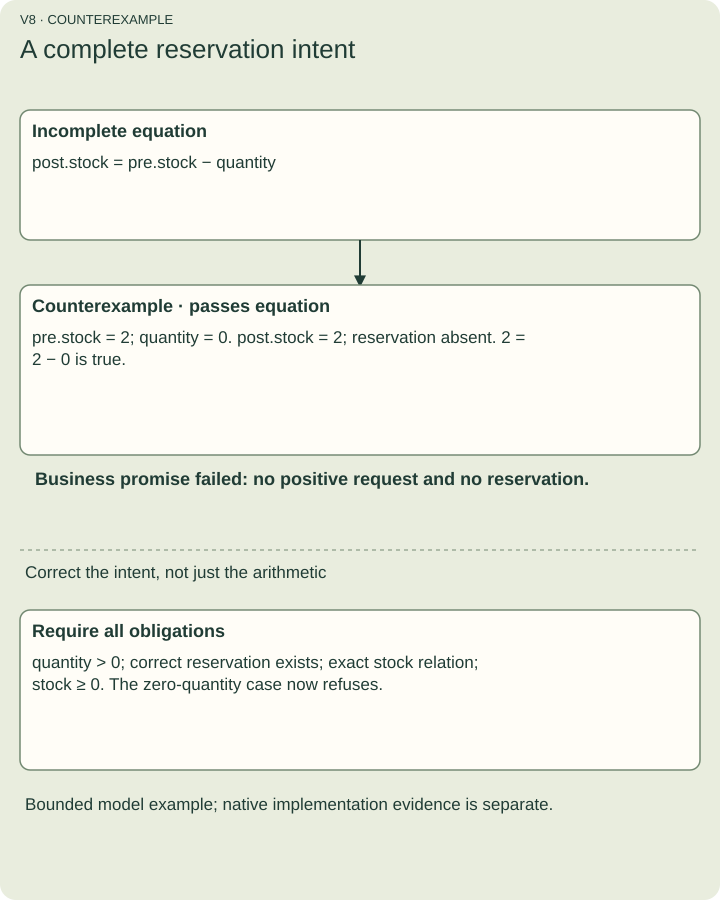

# Find mistakes before they become incidents

Examples show a few outcomes. Formal analysis makes assumptions and properties explicit, then searches for cases that contradict them. It helps answer “what did we forget?”; it does not turn an unbounded system into a proven production service.

## Start with a property

An **invariant** is a rule that must remain true in every accepted state. For reserving stock, nonnegative stock is necessary but insufficient: the request must also use a positive quantity and create the promised reservation for the correct entities.

Without those requirements, a zero-quantity request or a missing reservation may satisfy a stock equation while failing the business intent. A **counterexample** is a concrete case showing that gap.

Figure V8. The original equation alone allows zero quantity and missing reservation. The corrected intent checks positive quantity, reservation existence and identity, and the exact stock relation. This is a design example requiring a qualified handler for computed writes, not the literal approve recipe.

## Explore the order of events

Two requests can both read “one unit remains.” An **interleaving** is the order their steps take. If checking and writing occur outside a shared transaction boundary, both can decide to reserve the final unit. The native reference consumer serializes its invariant and authorization boundary; disjoint write frames alone do not prove independence.

## Understand each kind of evidence

- SMT checks encode constraints and ask whether a violating assignment exists. A no-counterexample result applies to the encoded assumptions and value domains.
- TLC checks a finite TLA+ state model across possible transitions. Safety means a bad state is unreachable; progress properties also depend on stated scheduling and fairness assumptions.
- History checking asks whether observed concurrent operations fit an allowed sequential behavior while respecting observed real-time order.
- Native refinement compares actual store executions with independent expected transitions. The recorded action campaign covers 216 histories and 648 transitions.
- Implementation mutation deliberately removes a safeguard from actual copied code. The five recorded mutant failures demonstrate that their named negative controls can detect those faults.

The original SMT/TLC probes, simplified SQL feasibility executor and actual reference implementation are different sources. Do not give one their combined proof credit. Browser parity proves the tested portable interpretation corpus, not database isolation.

## Reproduce and inspect

Read the [bounded model sources and pinned tool setup](../../../02-design/experiments/actions/formal/README.md). From a clone of this repository, run `python3 scripts/actions-docs/reproduce-formal.py` for SMT, or add `--tlc` to also run the finite state models. The TLC command pulls a pinned public Java 21 image; its recorded qualification is Linux ARM64. Use the acceptance certificate for actual implementation witnesses, runtime versions, source hashes, assumptions and exclusions. Retained logs include failed intermediate attempts; only final qualified gates count as passes.

## Predict the result

A model checks every state with two actors and a bounded stock range. Does that prove every deployment with arbitrarily many actors?

Answer: no. It proves the stated finite model result. Generalizing needs an argument or additional evidence, and still requires checking that real execution implements the model.
