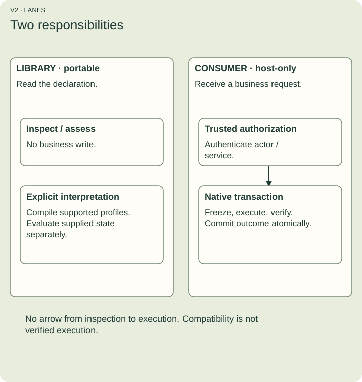

# Understand and use UMF actions

UMF is a machine-readable model of schemas and metadata. An action describes a requested business change: its inputs, permitted access, conditions and implementation binding. Reading that description does not perform the change.

This guide starts with an order that needs approval. You do not need prior knowledge of UMF, CQRS or formal analysis. First inspect a declaration without a database. Then learn how a separate consumer executes it safely.

## Choose your starting point

- [Meet the model](concepts.md): Fields, Records, Keys and extensions.
- [Run the first example](getting-started.md): inspect an actual action in Bun or the browser.
- [Write a declaration](declarations.md): permissions, recipes and handlers.
- [Follow an execution](execution.md): authorization, outcomes and retries.
- [Understand read visibility](receipts-and-queries.md): CQRS and receipts.
- [Understand the analysis](formal-analysis.md): invariants, counterexamples and evidence.
- [Look up an API](api-reference.md): functions, types, errors and limits.
- [Check support and evidence](support-and-evidence.md): exact versions and boundaries.
- [Look up a word](glossary.md): definitions used throughout this guide.

## What you will be able to do

Run portable inspection, explain why it changes no order, identify an unsupported declaration, distinguish rollback from an uncertain result, and decide when a query is fresh enough. Native execution is an optional local exercise with Docker; it is not a hosted UMF service.

Figure V2. The library lane checks metadata. The consumer lane owns authentication and business transactions. No inspection or compatibility check invokes the consumer. [Text explanation](concepts.md).

The repository is the installation source; the TypeScript package is not published to npm. Core document version 0.8.0 and action extension version 0.1.0 are different from package and release versions.
