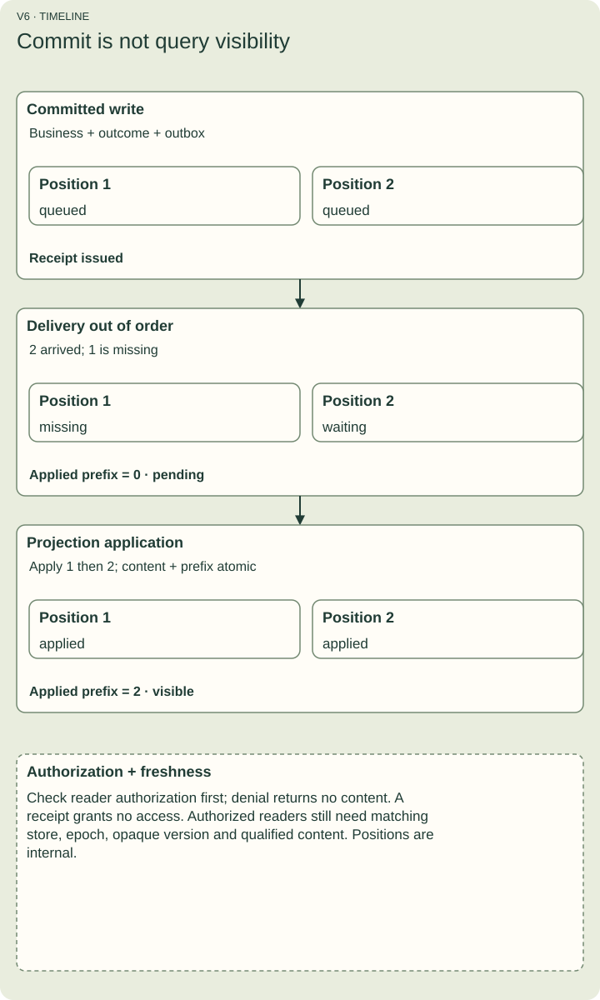

# Know when a query is fresh enough

**CQRS** means Command Query Responsibility Segregation: keep decisions that change state separate from the models used to answer reads. It need not mean separate physical databases or event sourcing.

An approved order can be committed while a search page still shows its old status. A **projection** is a read model built from committed facts. Delivery and application happen after the business transaction.

Figure V6. Business changes, terminal outcome and an outbox fact commit together. Fact 2 can arrive before fact 1; receiving 2 alone leaves the complete applied prefix at 0. Applying 1 and then 2 updates content and prefix atomically. Only then can a qualified projection satisfy a receipt for commit 2 for an authorized reader. A receipt does not grant read permission.

## Read the receipt

A receipt has store, epoch and opaque version. The consumer maps that version under its qualified adapter; do not sort it as a string or assume it is a portable integer clock. readAtLeast first checks current reader authorization. A denied reader receives denied/AUTHORIZATION, without projection content. A receipt states a freshness requirement; it grants no access. For an authorized reader, readAtLeast binds the receipt to a named projection and reports visible, pending or unsupported.

Visible requires both the applied complete commit prefix and the projection's content semantics to expose the relevant changes. A high maximum seen event ID is insufficient. Pending reads cannot secretly query live state to disguise projection lag.

## Repeated delivery is expected

The outbox is committed storage of a publication fact. A worker may deliver the same fact more than once. The reference projection deduplicates exact facts, applies only the next position and publishes its content and prefix together. This is not an exactly-once network delivery promise or a requirement to reconstruct all business state from events.

## Restoring is a separate risk

A new epoch invalidates old receipts. It does not erase replay identity or prove business state and retained outcomes are consistent after restore. An uncertain restored store is fenced against invocation until separately qualified reconciliation or a fresh namespace procedure. A missing token in an older backup does not permit duplicate execution.

## Predict the result

A reader sees event 12, but event 11 has not been applied. Can it claim visibility through 12?

Answer: no. It must apply the complete prefix and the correct content, not just observe a larger number.
